```mermaid
graph LR
    Flow_Definition_FlowSpec_["Flow Definition (FlowSpec)"]
    Flow_Graph_Management["Flow Graph Management"]
    Native_Workflow_Execution["Native Workflow Execution"]
    Worker_Process_Management["Worker Process Management"]
    Subprocess_Orchestration["Subprocess Orchestration"]
    Flow_Execution_Orchestrator["Flow Execution Orchestrator"]
    Notebook_Integration["Notebook Integration"]
    Workflow_Deployment_Framework["Workflow Deployment Framework"]
    Flow_Definition_FlowSpec_ -- "defines structure for" --> Flow_Graph_Management
    Flow_Definition_FlowSpec_ -- "defines execution logic for" --> Native_Workflow_Execution
    Flow_Graph_Management -- "provides flow structure to" --> Native_Workflow_Execution
    Native_Workflow_Execution -- "manages tasks via" --> Worker_Process_Management
    Native_Workflow_Execution -- "utilizes" --> Subprocess_Orchestration
    Worker_Process_Management -- "provides process control to" --> Native_Workflow_Execution
    Subprocess_Orchestration -- "executes commands for" --> Flow_Execution_Orchestrator
    Subprocess_Orchestration -- "executes commands for" --> Workflow_Deployment_Framework
    Flow_Execution_Orchestrator -- "invokes" --> Native_Workflow_Execution
    Flow_Execution_Orchestrator -- "provides interface for" --> Notebook_Integration
    Notebook_Integration -- "extends" --> Flow_Execution_Orchestrator
    Workflow_Deployment_Framework -- "utilizes" --> Subprocess_Orchestration
    Workflow_Deployment_Framework -- "integrates with" --> Flow_Execution_Orchestrator
```

## Component Details

The Core Workflow Engine is the central component responsible for defining, parsing, executing, and deploying Metaflow workflows. It manages the flow graph, individual task execution, and integrates with various runtime environments. It encompasses components for flow definition, graph management, native execution, worker process management, subprocess orchestration, overall flow orchestration, notebook integration, and deployment.

### Flow Definition (FlowSpec)
The Flow Definition (FlowSpec) component is the foundational class for defining Metaflow workflows. Users inherit from FlowSpec to structure their flows, declare parameters, and define step transitions. It processes configuration decorators, manages constants, and provides mechanisms for navigating the flow graph, including `next()` for step transitions and `merge_artifacts()` for data handling in join steps. It also supports parallel execution through integration with `UnboundedForeachInput`.

**Related Classes/Methods**:

- <a href="https://github.com/netflix/metaflow/blob/master/metaflow/flowspec.py#L140-L934" target="_blank" rel="noopener noreferrer">`metaflow.flowspec.FlowSpec` (140:934)</a>
- <a href="https://github.com/netflix/metaflow/blob/master/metaflow/flowspec.py#L56-L63" target="_blank" rel="noopener noreferrer">`metaflow.flowspec.InvalidNextException` (56:63)</a>
- <a href="https://github.com/netflix/metaflow/blob/master/metaflow/flowspec.py#L66-L75" target="_blank" rel="noopener noreferrer">`metaflow.flowspec.ParallelUBF` (66:75)</a>
- <a href="https://github.com/netflix/metaflow/blob/master/metaflow/flowspec.py#L84-L137" target="_blank" rel="noopener noreferrer">`metaflow.flowspec.FlowSpecMeta` (84:137)</a>
- <a href="https://github.com/netflix/metaflow/blob/master/metaflow/unbounded_foreach.py#L6-L12" target="_blank" rel="noopener noreferrer">`metaflow.unbounded_foreach.UnboundedForeachInput` (6:12)</a>

### Flow Graph Management
This component is responsible for constructing and representing the directed acyclic graph (DAG) of a Metaflow flow. It parses the flow definition to identify steps and their transitions, enabling visualization and traversal of the flow's structure. It provides core functionalities for creating nodes and traversing the graph, and its output is utilized by various orchestrators.

**Related Classes/Methods**:

- <a href="https://github.com/netflix/metaflow/blob/master/metaflow/graph.py#L162-L338" target="_blank" rel="noopener noreferrer">`metaflow.graph.FlowGraph` (162:338)</a>
- <a href="https://github.com/netflix/metaflow/blob/master/metaflow/graph.py#L47-L159" target="_blank" rel="noopener noreferrer">`metaflow.graph.DAGNode` (47:159)</a>

### Native Workflow Execution
This component handles the local execution of Metaflow workflows. It manages the entire lifecycle of individual tasks, including their creation, persistence of constants, and execution. It coordinates with worker process management for task launching and monitoring, handles retries for failed workers, and integrates with the data store for artifact management.

**Related Classes/Methods**:

- <a href="https://github.com/netflix/metaflow/blob/master/metaflow/runtime.py#L76-L1000" target="_blank" rel="noopener noreferrer">`metaflow.runtime.NativeRuntime` (76:1000)</a>
- `metaflow.runtime.Task` (full file reference)
- `metaflow.runtime.TaskFailed` (full file reference)
- `metaflow.runtime.CLIArgs` (full file reference)
- `metaflow.task` (full file reference)

### Worker Process Management
This component is dedicated to launching, managing, and monitoring individual worker processes responsible for executing flow steps. It sets up the execution environment for each worker, including command-line arguments and tracing variables, manages logging output, and ensures proper process termination and resource cleanup, leveraging OS-specific process polling mechanisms.

**Related Classes/Methods**:

- `metaflow.runtime.Worker` (full file reference)
- <a href="https://github.com/netflix/metaflow/blob/master/metaflow/procpoll.py#L23-L40" target="_blank" rel="noopener noreferrer">`metaflow.procpoll.LinuxProcPoll` (23:40)</a>
- <a href="https://github.com/netflix/metaflow/blob/master/metaflow/procpoll.py#L43-L61" target="_blank" rel="noopener noreferrer">`metaflow.procpoll.DarwinProcPoll` (43:61)</a>
- <a href="https://github.com/netflix/metaflow/blob/master/metaflow/procpoll.py#L64-L73" target="_blank" rel="noopener noreferrer">`metaflow.procpoll.make_poll` (64:73)</a>
- <a href="https://github.com/netflix/metaflow/blob/master/metaflow/procpoll.py#L12-L20" target="_blank" rel="noopener noreferrer">`metaflow.procpoll.ProcPoll` (12:20)</a>

### Subprocess Orchestration
This component provides a robust and generalized mechanism for executing external commands as subprocesses. It handles the creation, continuous monitoring, and graceful termination of these processes, including signal handling (e.g., SIGINT). It also manages the streaming and emission of logs from subprocesses and ensures proper resource cleanup, serving as a fundamental layer for both workflow execution and deployment.

**Related Classes/Methods**:

- <a href="https://github.com/netflix/metaflow/blob/master/metaflow/runner/subprocess_manager.py#L71-L210" target="_blank" rel="noopener noreferrer">`metaflow.runner.subprocess_manager.SubprocessManager` (71:210)</a>
- <a href="https://github.com/netflix/metaflow/blob/master/metaflow/runner/subprocess_manager.py#L213-L534" target="_blank" rel="noopener noreferrer">`metaflow.runner.subprocess_manager.CommandManager` (213:534)</a>

### Flow Execution Orchestrator
This high-level component orchestrates the overall execution of Metaflow flows. It interacts with the subprocess orchestration system to run flow commands, supporting both synchronous and asynchronous execution. It manages the retrieval of execution results and provides necessary cleanup mechanisms for resources utilized during a flow run. It also serves as the base for specialized execution environments like the Notebook Runner.

**Related Classes/Methods**:

- <a href="https://github.com/netflix/metaflow/blob/master/metaflow/runner/metaflow_runner.py#L215-L508" target="_blank" rel="noopener noreferrer">`metaflow.runner.metaflow_runner.Runner` (215:508)</a>
- <a href="https://github.com/netflix/metaflow/blob/master/metaflow/runner/metaflow_runner.py#L195-L212" target="_blank" rel="noopener noreferrer">`metaflow.runner.metaflow_runner.RunnerMeta` (195:212)</a>
- <a href="https://github.com/netflix/metaflow/blob/master/metaflow/runner/metaflow_runner.py#L23-L192" target="_blank" rel="noopener noreferrer">`metaflow.runner.metaflow_runner.ExecutingRun` (23:192)</a>

### Notebook Integration
This component provides specialized functionality for seamlessly running and managing Metaflow flows within interactive notebook environments. It adapts the core `Flow Execution Orchestrator` to the notebook context, handling environment-specific initialization and cleanup, enabling users to directly execute and resume flows from their notebooks.

**Related Classes/Methods**:

- <a href="https://github.com/netflix/metaflow/blob/master/metaflow/runner/nbrun.py#L15-L225" target="_blank" rel="noopener noreferrer">`metaflow.runner.nbrun.NBRunner` (15:225)</a>

### Workflow Deployment Framework
This component offers a comprehensive set of utilities and classes for deploying Metaflow flows to various external orchestrators and environments. It encompasses functionalities for managing temporary files and directories, handling process execution timeouts, and preparing command-line arguments for lower-level deployment processes. It provides the foundational support for creating and managing deployment-related subprocesses and serves as a base for specific deployers, including notebook-based deployments.

**Related Classes/Methods**:

- <a href="https://github.com/netflix/metaflow/blob/master/metaflow/runner/deployer_impl.py#L22-L193" target="_blank" rel="noopener noreferrer">`metaflow.runner.deployer_impl.DeployerImpl` (22:193)</a>
- <a href="https://github.com/netflix/metaflow/blob/master/metaflow/runner/deployer.py#L64-L94" target="_blank" rel="noopener noreferrer">`metaflow.runner.deployer.DeployerMeta` (64:94)</a>
- <a href="https://github.com/netflix/metaflow/blob/master/metaflow/runner/deployer.py#L147-L214" target="_blank" rel="noopener noreferrer">`metaflow.runner.deployer.TriggeredRun` (147:214)</a>
- <a href="https://github.com/netflix/metaflow/blob/master/metaflow/runner/deployer.py#L217-L299" target="_blank" rel="noopener noreferrer">`metaflow.runner.deployer.DeployedFlowMeta` (217:299)</a>
- <a href="https://github.com/netflix/metaflow/blob/master/metaflow/runner/deployer.py#L97-L144" target="_blank" rel="noopener noreferrer">`metaflow.runner.deployer.Deployer` (97:144)</a>
- <a href="https://github.com/netflix/metaflow/blob/master/metaflow/runner/nbdeploy.py#L15-L132" target="_blank" rel="noopener noreferrer">`metaflow.runner.nbdeploy.NBDeployer` (15:132)</a>
- `metaflow.runner.utils` (full file reference)

### [FAQ](https://github.com/CodeBoarding/GeneratedOnBoardings/tree/main?tab=readme-ov-file#faq)