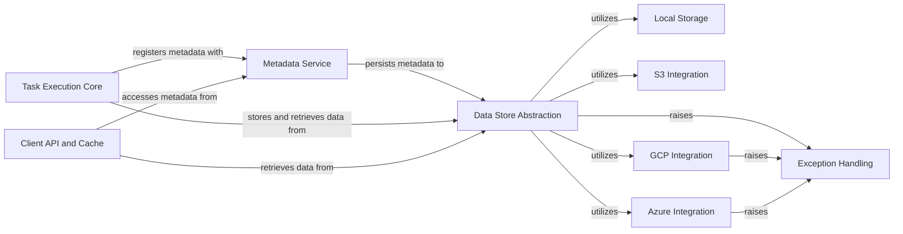

## Component Details

The Data & Metadata Services component in Metaflow is responsible for the robust and efficient persistence, retrieval, and versioning of all data artifacts and metadata generated during flow runs. It provides a unified abstraction layer over various local and cloud storage backends, ensuring seamless data management regardless of the underlying infrastructure. This component is crucial for maintaining the state, history, and traceability of Metaflow executions, enabling features like resuming runs, inspecting past results, and managing dependencies.

### Data Store Abstraction
Provides a unified interface for persisting and retrieving data artifacts and logs, abstracting the underlying storage mechanisms. It includes content-addressed storage for efficient data management.

**Related Classes/Methods**:

- <a href="https://github.com/netflix/metaflow/blob/master/metaflow/datastore/datastore_set.py#L15-L58" target="_blank" rel="noopener noreferrer">`metaflow.datastore.datastore_set.TaskDataStoreSet` (15:58)</a>
- <a href="https://github.com/netflix/metaflow/blob/master/metaflow/datastore/flow_datastore.py#L10-L267" target="_blank" rel="noopener noreferrer">`metaflow.datastore.flow_datastore.FlowDataStore` (10:267)</a>
- <a href="https://github.com/netflix/metaflow/blob/master/metaflow/datastore/content_addressed_store.py#L11-L188" target="_blank" rel="noopener noreferrer">`metaflow.datastore.content_addressed_store.ContentAddressedStore` (11:188)</a>
- <a href="https://github.com/netflix/metaflow/blob/master/metaflow/datastore/datastore_storage.py#L26-L273" target="_blank" rel="noopener noreferrer">`metaflow.datastore.datastore_storage.DataStoreStorage` (26:273)</a>
- <a href="https://github.com/netflix/metaflow/blob/master/metaflow/datastore/task_datastore.py#L57-L965" target="_blank" rel="noopener noreferrer">`metaflow.datastore.task_datastore.TaskDataStore` (57:965)</a>
- <a href="https://github.com/netflix/metaflow/blob/master/metaflow/datastore/inputs.py#L1-L18" target="_blank" rel="noopener noreferrer">`metaflow.datastore.inputs.Inputs` (1:18)</a>
- <a href="https://github.com/netflix/metaflow/blob/master/metaflow/datastore/exceptions.py#L4-L5" target="_blank" rel="noopener noreferrer">`metaflow.datastore.exceptions.DataException` (4:5)</a>
- <a href="https://github.com/netflix/metaflow/blob/master/metaflow/datastore/exceptions.py#L8-L13" target="_blank" rel="noopener noreferrer">`metaflow.datastore.exceptions.UnpicklableArtifactException` (8:13)</a>

### Metadata Service
Manages all metadata related to Metaflow runs, including flow, run, step, and task information, user-defined tags, and system metadata. It supports both local and service-based metadata providers.

**Related Classes/Methods**:

- `metaflow.metadata_provider.metadata.MetaDatum` (full file reference)
- <a href="https://github.com/netflix/metaflow/blob/master/metaflow/metadata_provider/metadata.py#L79-L813" target="_blank" rel="noopener noreferrer">`metaflow.metadata_provider.metadata.MetadataProvider` (79:813)</a>
- <a href="https://github.com/netflix/metaflow/blob/master/metaflow/metadata_provider/heartbeat.py#L21-L93" target="_blank" rel="noopener noreferrer">`metaflow.metadata_provider.heartbeat.MetadataHeartBeat` (21:93)</a>
- <a href="https://github.com/netflix/metaflow/blob/master/metaflow/metadata_provider/util.py#L28-L36" target="_blank" rel="noopener noreferrer">`metaflow.metadata_provider.util.sync_local_metadata_to_datastore` (28:36)</a>
- <a href="https://github.com/netflix/metaflow/blob/master/metaflow/metadata_provider/util.py#L39-L52" target="_blank" rel="noopener noreferrer">`metaflow.metadata_provider.util.sync_local_metadata_from_datastore` (39:52)</a>
- <a href="https://github.com/netflix/metaflow/blob/master/metaflow/plugins/metadata_providers/service.py#L36-L610" target="_blank" rel="noopener noreferrer">`metaflow.plugins.metadata_providers.service.ServiceMetadataProvider` (36:610)</a>
- <a href="https://github.com/netflix/metaflow/blob/master/metaflow/plugins/metadata_providers/local.py#L19-L636" target="_blank" rel="noopener noreferrer">`metaflow.plugins.metadata_providers.local.LocalMetadataProvider` (19:636)</a>

### Local Storage
Implements the concrete storage mechanism for local file system persistence of data artifacts and logs.

**Related Classes/Methods**:

- `metaflow.plugins.datastores.local_storage` (full file reference)

### S3 Integration
Provides specific functionalities for Metaflow to interact with Amazon S3 for data storage and retrieval.

**Related Classes/Methods**:

- <a href="https://github.com/netflix/metaflow/blob/master/metaflow/plugins/datastores/s3_storage.py#L18-L146" target="_blank" rel="noopener noreferrer">`metaflow.plugins.datastores.s3_storage.S3Storage` (18:146)</a>

### Azure Integration
Provides specific functionalities for Metaflow to interact with Microsoft Azure Blob Storage for data storage and retrieval.

**Related Classes/Methods**:

- <a href="https://github.com/netflix/metaflow/blob/master/metaflow/plugins/datastores/azure_storage.py#L257-L405" target="_blank" rel="noopener noreferrer">`metaflow.plugins.datastores.azure_storage.AzureStorage` (257:405)</a>

### GCP Integration
Provides specific functionalities for Metaflow to interact with Google Cloud Storage for data storage and retrieval.

**Related Classes/Methods**:

- <a href="https://github.com/netflix/metaflow/blob/master/metaflow/plugins/datastores/gs_storage.py#L147-L278" target="_blank" rel="noopener noreferrer">`metaflow.plugins.datastores.gs_storage.GSStorage` (147:278)</a>

### Exception Handling
Defines custom exceptions for data operations and package dependencies within the data and metadata services.

**Related Classes/Methods**:

- <a href="https://github.com/netflix/metaflow/blob/master/metaflow/exception.py#L143-L144" target="_blank" rel="noopener noreferrer">`metaflow.metaflow.exception.MetaflowDataMissing` (143:144)</a>
- <a href="https://github.com/netflix/metaflow/blob/master/metaflow/datastore/exceptions.py#L4-L5" target="_blank" rel="noopener noreferrer">`metaflow.metaflow.datastore.exceptions.DataException` (4:5)</a>
- <a href="https://github.com/netflix/metaflow/blob/master/metaflow/datastore/exceptions.py#L8-L13" target="_blank" rel="noopener noreferrer">`metaflow.metaflow.datastore.exceptions.UnpicklableArtifactException` (8:13)</a>
- <a href="https://github.com/netflix/metaflow/blob/master/metaflow/plugins/gcp/gs_exceptions.py#L4-L5" target="_blank" rel="noopener noreferrer">`metaflow.plugins.gcp.gs_exceptions.MetaflowGSPackageError` (4:5)</a>
- <a href="https://github.com/netflix/metaflow/blob/master/metaflow/plugins/azure/azure_exceptions.py#L12-L13" target="_blank" rel="noopener noreferrer">`metaflow.plugins.azure.azure_exceptions.MetaflowAzurePackageError` (12:13)</a>

### Task Execution Core
Responsible for the fundamental execution logic of individual steps, including initialization of task-specific data and orchestration of step execution, interacting with data stores and metadata providers.

**Related Classes/Methods**:

- <a href="https://github.com/netflix/metaflow/blob/master/metaflow/task.py#L128-L170" target="_blank" rel="noopener noreferrer">`metaflow.metaflow.task.MetaflowTask:_init_data` (128:170)</a>
- <a href="https://github.com/netflix/metaflow/blob/master/metaflow/task.py#L375-L783" target="_blank" rel="noopener noreferrer">`metaflow.metaflow.task.MetaflowTask:run_step` (375:783)</a>

### Client API and Cache
Provides the public Python API for programmatic access to Metaflow runs, flows, steps, and tasks, including a file-based caching mechanism for optimized data retrieval.

**Related Classes/Methods**:

- `metaflow.metaflow.client.core.DataArtifact` (full file reference)
- `metaflow.metaflow.client.core.Task` (full file reference)
- `metaflow.metaflow.client.core.MetaflowData` (full file reference)
- <a href="https://github.com/netflix/metaflow/blob/master/metaflow/client/filecache.py#L42-L421" target="_blank" rel="noopener noreferrer">`metaflow.metaflow.client.filecache.FileCache` (42:421)</a>
- <a href="https://github.com/netflix/metaflow/blob/master/metaflow/client/filecache.py#L424-L439" target="_blank" rel="noopener noreferrer">`metaflow.metaflow.client.filecache.FileBlobCache` (424:439)</a>

### [FAQ](https://github.com/CodeBoarding/GeneratedOnBoardings/tree/main?tab=readme-ov-file#faq)