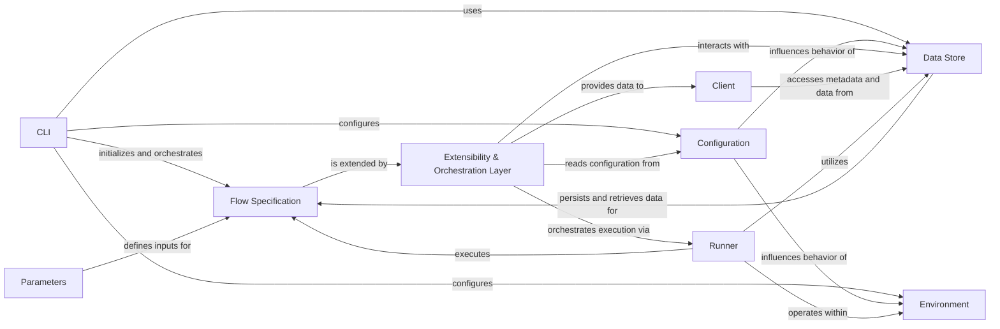

## Component Details

This graph illustrates the core components of Metaflow, a framework for building and managing data science workflows. It highlights how the Command Line Interface (CLI) orchestrates flow execution, interacting with Flow Specifications, Parameters, and the Data Store. The system is highly configurable through the Configuration and Environment components, ensuring consistent execution. A key aspect is the Extensibility & Orchestration Layer, which uses decorators and a plugin architecture to integrate with external platforms and enhance flow capabilities. The Runner component handles the actual execution of flows, while the Client provides programmatic access to flow metadata and data artifacts.

### CLI
The Command Line Interface component provides the main entry point for users to interact with Metaflow. It handles command parsing, initializes the Metaflow environment, loads flow definitions, and orchestrates the execution of various Metaflow commands like 'run', 'check', 'show', and 'resume'. It integrates with other core components to set up the necessary context for a Metaflow run.

**Related Classes/Methods**:

- <a href="https://github.com/netflix/metaflow/blob/master/metaflow/cli.py#L119-L120" target="_blank" rel="noopener noreferrer">`metaflow.cli.cli` (119:120)</a>
- <a href="https://github.com/netflix/metaflow/blob/master/metaflow/cli.py#L298-L542" target="_blank" rel="noopener noreferrer">`metaflow.cli.start` (298:542)</a>
- <a href="https://github.com/netflix/metaflow/blob/master/metaflow/cli.py#L131-L146" target="_blank" rel="noopener noreferrer">`metaflow.cli.check` (131:146)</a>
- <a href="https://github.com/netflix/metaflow/blob/master/metaflow/cli.py#L151-L165" target="_blank" rel="noopener noreferrer">`metaflow.cli.show` (151:165)</a>
- <a href="https://github.com/netflix/metaflow/blob/master/metaflow/cli.py#L170-L171" target="_blank" rel="noopener noreferrer">`metaflow.cli.help` (170:171)</a>
- <a href="https://github.com/netflix/metaflow/blob/master/metaflow/cli.py#L177-L190" target="_blank" rel="noopener noreferrer">`metaflow.cli.output_raw` (177:190)</a>
- <a href="https://github.com/netflix/metaflow/blob/master/metaflow/cli.py#L195-L202" target="_blank" rel="noopener noreferrer">`metaflow.cli.output_dot` (195:202)</a>
- <a href="https://github.com/netflix/metaflow/blob/master/metaflow/cli.py#L207-L208" target="_blank" rel="noopener noreferrer">`metaflow.cli.version` (207:208)</a>
- <a href="https://github.com/netflix/metaflow/blob/master/metaflow/cli.py#L604-L641" target="_blank" rel="noopener noreferrer">`metaflow.cli.main` (604:641)</a>

### Flow Specification
The Flow Specification component defines the structure and behavior of a Metaflow flow. It provides the base class `FlowSpec` that users extend to define their data science workflows, including steps, transitions, and data artifacts. It interacts with decorators to apply specific functionalities to steps and manages the internal graph representation of the flow.

**Related Classes/Methods**:

- <a href="https://github.com/netflix/metaflow/blob/master/metaflow/flowspec.py#L140-L934" target="_blank" rel="noopener noreferrer">`metaflow.flowspec.FlowSpec` (140:934)</a>
- <a href="https://github.com/netflix/metaflow/blob/master/metaflow/flowspec.py#L78-L81" target="_blank" rel="noopener noreferrer">`metaflow.flowspec._FlowState` (78:81)</a>

### Parameters
The Parameters component handles the definition and management of parameters within Metaflow flows. It allows users to define configurable inputs for their workflows, which can be set at runtime via the CLI or other deployment mechanisms. This component ensures that parameter values are correctly parsed and made available to the flow's execution.

**Related Classes/Methods**:

- <a href="https://github.com/netflix/metaflow/blob/master/metaflow/parameters.py#L234-L247" target="_blank" rel="noopener noreferrer">`metaflow.parameters.set_parameter_context` (234:247)</a>

### Data Store
The Data Store component is responsible for managing the persistence and retrieval of data artifacts generated during a Metaflow run. It abstracts the underlying storage mechanism (e.g., local filesystem, S3) and provides interfaces for flows to read and write data. It ensures data integrity and versioning across different runs and steps.

**Related Classes/Methods**:

- `metaflow.datastore.FlowDataStore` (full file reference)
- `metaflow.datastore.TaskDataStoreSet` (full file reference)
- `metaflow.datastore.content_addressed_store` (full file reference)
- `metaflow.datastore.datastore_set` (full file reference)
- `metaflow.datastore.datastore_storage` (full file reference)
- `metaflow.datastore.flow_datastore` (full file reference)
- `metaflow.datastore.inputs` (full file reference)
- `metaflow.datastore.task_datastore` (full file reference)

### Configuration
The Configuration component centralizes the management of Metaflow's global and flow-specific settings. It provides mechanisms to load configurations from various sources, including environment variables and configuration files. This component ensures that other Metaflow components operate with the correct settings, influencing aspects like datastore roots, metadata services, and plugin behaviors.

**Related Classes/Methods**:

- `metaflow.metaflow_config.DEFAULT_DATASTORE` (full file reference)
- `metaflow.metaflow_config.DEFAULT_DECOSPECS` (full file reference)
- `metaflow.metaflow_config.DEFAULT_ENVIRONMENT` (full file reference)
- `metaflow.metaflow_config.DEFAULT_EVENT_LOGGER` (full file reference)
- `metaflow.metaflow_config.DEFAULT_METADATA` (full file reference)
- `metaflow.metaflow_config.DEFAULT_MONITOR` (full file reference)
- `metaflow.metaflow_config.DEFAULT_PACKAGE_SUFFIXES` (full file reference)
- `metaflow.metaflow_config_funcs` (full file reference)

### Environment
The Environment component defines and manages the execution environment for Metaflow runs. It handles aspects like Python environment setup, dependency management, and integration with different compute platforms. This component ensures that the flow executes in a consistent and reproducible environment, regardless of where it is run.

**Related Classes/Methods**:

- <a href="https://github.com/netflix/metaflow/blob/master/metaflow/metaflow_environment.py#L18-L225" target="_blank" rel="noopener noreferrer">`metaflow.metaflow_environment.MetaflowEnvironment` (18:225)</a>

### Extensibility & Orchestration Layer
A modular system that extends Metaflow's capabilities through decorators and a comprehensive plugin architecture. It enables integration with external orchestration platforms (e.g., AWS Batch, Kubernetes, Airflow, Argo), manages secrets, and provides mechanisms for enhancing flow behavior (e.g., retries, timeouts, parallel execution) and generating rich reports (Metaflow Cards).

**Related Classes/Methods**:

- `metaflow.decorators` (full file reference)
- `metaflow.user_configs.config_decorators` (full file reference)
- `metaflow.extension_support` (full file reference)
- `metaflow.plugins` (full file reference)
- `metaflow.plugins.aws` (full file reference)
- `metaflow.plugins.kubernetes` (full file reference)
- `metaflow.plugins.airflow` (full file reference)
- `metaflow.plugins.argo` (full file reference)
- `metaflow.plugins.timeout_decorator` (full file reference)
- `metaflow.plugins.retry_decorator` (full file reference)
- `metaflow.plugins.catch_decorator` (full file reference)
- `metaflow.plugins.project_decorator` (full file reference)
- `metaflow.plugins.parallel_decorator` (full file reference)
- `metaflow.plugins.events_decorator` (full file reference)
- `metaflow.plugins.secrets` (full file reference)
- `metaflow.plugins.cards` (full file reference)

### Client
The Client component provides a programmatic interface for interacting with Metaflow runs and accessing their metadata and data artifacts. It allows users to query past runs, retrieve results, and manage flow executions from Python scripts or interactive environments. This component is essential for building applications on top of Metaflow and for analyzing completed workflows.

**Related Classes/Methods**:

- `metaflow.client.Client` (full file reference)
- `metaflow.client.core` (full file reference)
- `metaflow.client.filecache` (full file reference)

### Runner
The Runner component is responsible for executing Metaflow flows. It orchestrates the execution of steps, manages the lifecycle of tasks, and handles the underlying process management. This component ensures that the flow progresses correctly through its defined steps, coordinating with other components for data access, logging, and environment setup.

**Related Classes/Methods**:

- `metaflow.runner.metaflow_runner` (full file reference)
- `metaflow.runner.deployer` (full file reference)
- `metaflow.runner.deployer_impl` (full file reference)
- `metaflow.runner.subprocess_manager` (full file reference)
- `metaflow.runner.utils` (full file reference)

### [FAQ](https://github.com/CodeBoarding/GeneratedOnBoardings/tree/main?tab=readme-ov-file#faq)