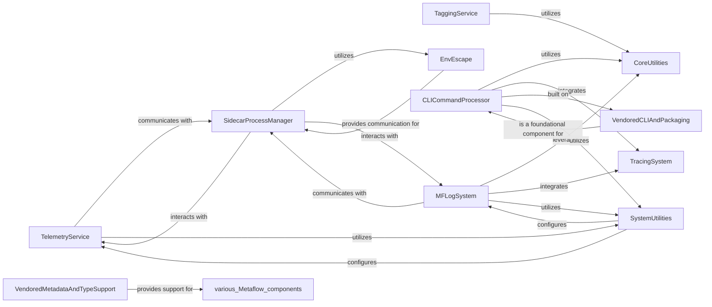

## Component Details

This graph describes the Observability & System Utilities component of Metaflow. It encompasses functionalities for tracing, monitoring, logging, and managing background sidecar processes, along with general-purpose utility functions and vendored libraries. The main flow involves various components interacting to provide system-level support, such as `SidecarProcessManager` handling background tasks for `TelemetryService` and `MFLogSystem`, while `CLICommandProcessor` orchestrates command execution leveraging `CoreUtilities`, `TracingSystem`, and `SystemUtilities`. `EnvEscape` facilitates inter-process communication, and `VendoredCLIAndPackaging` and `VendoredMetadataAndTypeSupport` provide foundational external libraries.

### TaggingService
Manages the validation of tags applied to Metaflow runs, ensuring they adhere to defined rules regarding size and character encoding. It raises specific MetaflowTaggingError exceptions for invalid tags.

**Related Classes/Methods**:

- <a href="https://github.com/netflix/metaflow/blob/master/metaflow/tagging_util.py#L33-L51" target="_blank" rel="noopener noreferrer">`metaflow.tagging_util:validate_tags` (33:51)</a>
- <a href="https://github.com/netflix/metaflow/blob/master/metaflow/tagging_util.py#L54-L76" target="_blank" rel="noopener noreferrer">`metaflow.tagging_util:validate_tag` (54:76)</a>
- <a href="https://github.com/netflix/metaflow/blob/master/metaflow/tagging_util.py#L5-L13" target="_blank" rel="noopener noreferrer">`metaflow.tagging_util:is_utf8_encodable` (5:13)</a>
- <a href="https://github.com/netflix/metaflow/blob/master/metaflow/tagging_util.py#L16-L24" target="_blank" rel="noopener noreferrer">`metaflow.tagging_util:is_utf8_decodable` (16:24)</a>
- <a href="https://github.com/netflix/metaflow/blob/master/metaflow/exception.py#L111-L112" target="_blank" rel="noopener noreferrer">`metaflow.exception.MetaflowTaggingError` (111:112)</a>

### TelemetryService
Provides functionalities for logging events and monitoring metrics within Metaflow runs. It interacts with the SidecarProcessManager to send messages, including counters and timers.

**Related Classes/Methods**:

- <a href="https://github.com/netflix/metaflow/blob/master/metaflow/event_logger.py#L4-L29" target="_blank" rel="noopener noreferrer">`metaflow.event_logger.NullEventLogger` (4:29)</a>
- <a href="https://github.com/netflix/metaflow/blob/master/metaflow/monitor.py#L12-L65" target="_blank" rel="noopener noreferrer">`metaflow.monitor.NullMonitor` (12:65)</a>
- <a href="https://github.com/netflix/metaflow/blob/master/metaflow/monitor.py#L117-L152" target="_blank" rel="noopener noreferrer">`metaflow.monitor.Timer` (117:152)</a>
- <a href="https://github.com/netflix/metaflow/blob/master/metaflow/monitor.py#L155-L179" target="_blank" rel="noopener noreferrer">`metaflow.monitor.Counter` (155:179)</a>
- <a href="https://github.com/netflix/metaflow/blob/master/metaflow/monitor.py#L182-L206" target="_blank" rel="noopener noreferrer">`metaflow.monitor.Gauge` (182:206)</a>

### CoreUtilities
A collection of general-purpose utility functions used across the Metaflow system, including string manipulation, path resolution, command execution, and version information.

**Related Classes/Methods**:

- `metaflow.util` (full file reference)
- `metaflow.cmd_with_io` (full file reference)
- `metaflow.metaflow_version` (full file reference)
- `metaflow.debug` (full file reference)
- `metaflow.info_file` (full file reference)
- <a href="https://github.com/netflix/metaflow/blob/master/metaflow/exception.py#L107-L108" target="_blank" rel="noopener noreferrer">`metaflow.exception.MetaflowInternalError` (107:108)</a>
- <a href="https://github.com/netflix/metaflow/blob/master/metaflow/exception.py#L115-L123" target="_blank" rel="noopener noreferrer">`metaflow.exception.MetaflowUnknownUser` (115:123)</a>
- <a href="https://github.com/netflix/metaflow/blob/master/metaflow/exception.py#L81-L85" target="_blank" rel="noopener noreferrer">`metaflow.exception.ExternalCommandFailed` (81:85)</a>
- <a href="https://github.com/netflix/metaflow/blob/master/metaflow/plugins/datastores/local_storage.py#L13-L46" target="_blank" rel="noopener noreferrer">`metaflow.plugins.datastores.local_storage.LocalStorage.get_datastore_root_from_config` (13:46)</a>
- <a href="https://github.com/netflix/metaflow/blob/master/metaflow/datastore/datastore_storage.py#L105-L110" target="_blank" rel="noopener noreferrer">`metaflow.datastore.datastore_storage.DataStoreStorage.path_join` (105:110)</a>
- <a href="https://github.com/netflix/metaflow/blob/master/metaflow/user_configs/config_options.py#L151-L155" target="_blank" rel="noopener noreferrer">`metaflow.user_configs.config_options.ConfigInput.make_key_name` (151:155)</a>
- `metaflow.extension_support.update_package_info` (full file reference)

### MFLogSystem
Handles structured logging within Metaflow, including decorating log lines, parsing them, persisting them, and tailing logs from various data stores. It interacts with the SidecarProcessManager for log persistence.

**Related Classes/Methods**:

- `metaflow.mflog.mflog` (full file reference)
- <a href="https://github.com/netflix/metaflow/blob/master/metaflow/mflog/save_logs_periodically.py#L25-L44" target="_blank" rel="noopener noreferrer">`metaflow.mflog.save_logs_periodically.SaveLogsPeriodicallySidecar:_update_loop` (25:44)</a>
- <a href="https://github.com/netflix/metaflow/blob/master/metaflow/mflog/save_logs.py#L17-L63" target="_blank" rel="noopener noreferrer">`metaflow.mflog.save_logs:save_logs` (17:63)</a>
- `metaflow.mflog:tail_logs` (full file reference)
- `metaflow.mflog:get_log_tailer` (full file reference)
- `metaflow.tracing.cli` (full file reference)
- <a href="https://github.com/netflix/metaflow/blob/master/metaflow/datastore/flow_datastore.py#L10-L267" target="_blank" rel="noopener noreferrer">`metaflow.datastore.flow_datastore.FlowDataStore` (10:267)</a>
- <a href="https://github.com/netflix/metaflow/blob/master/metaflow/datastore/flow_datastore.py#L206-L225" target="_blank" rel="noopener noreferrer">`metaflow.datastore.flow_datastore.FlowDataStore.get_task_datastore` (206:225)</a>
- <a href="https://github.com/netflix/metaflow/blob/master/metaflow/datastore/task_datastore.py#L727-L750" target="_blank" rel="noopener noreferrer">`metaflow.datastore.task_datastore.TaskDataStore.save_logs` (727:750)</a>
- <a href="https://github.com/netflix/metaflow/blob/master/metaflow/plugins/datatools/s3/s3tail.py#L12-L86" target="_blank" rel="noopener noreferrer">`metaflow.plugins.datatools.s3.s3tail.S3Tail` (12:86)</a>
- <a href="https://github.com/netflix/metaflow/blob/master/metaflow/plugins/azure/azure_tail.py#L15-L78" target="_blank" rel="noopener noreferrer">`metaflow.plugins.azure.azure_tail.AzureTail` (15:78)</a>
- <a href="https://github.com/netflix/metaflow/blob/master/metaflow/plugins/gcp/gs_tail.py#L11-L75" target="_blank" rel="noopener noreferrer">`metaflow.plugins.gcp.gs_tail.GSTail` (11:75)</a>
- <a href="https://github.com/netflix/metaflow/blob/master/metaflow/exception.py#L107-L108" target="_blank" rel="noopener noreferrer">`metaflow.exception.MetaflowInternalError` (107:108)</a>

### CLICommandProcessor
Manages the execution of Metaflow CLI commands, specifically `run` and `resume`. It orchestrates the runtime, handles parameter parsing, and interacts with tracing and system logging.

**Related Classes/Methods**:

- <a href="https://github.com/netflix/metaflow/blob/master/metaflow/cli_components/run_cmds.py#L191-L301" target="_blank" rel="noopener noreferrer">`metaflow.cli_components.run_cmds:resume` (191:301)</a>
- <a href="https://github.com/netflix/metaflow/blob/master/metaflow/cli_components/run_cmds.py#L320-L382" target="_blank" rel="noopener noreferrer">`metaflow.cli_components.run_cmds:run` (320:382)</a>
- <a href="https://github.com/netflix/metaflow/blob/master/metaflow/parameters.py#L494-L512" target="_blank" rel="noopener noreferrer">`metaflow.parameters.add_custom_parameters` (494:512)</a>
- <a href="https://github.com/netflix/metaflow/blob/master/metaflow/runtime.py#L76-L1000" target="_blank" rel="noopener noreferrer">`metaflow.runtime.NativeRuntime` (76:1000)</a>
- <a href="https://github.com/netflix/metaflow/blob/master/metaflow/metaflow_current.py#L65-L67" target="_blank" rel="noopener noreferrer">`metaflow.metaflow_current.Current._update_env` (65:67)</a>
- <a href="https://github.com/netflix/metaflow/blob/master/metaflow/system/system_logger.py#L61-L85" target="_blank" rel="noopener noreferrer">`metaflow.system.system_logger.SystemLogger.log_event` (61:85)</a>
- <a href="https://github.com/netflix/metaflow/blob/master/metaflow/exception.py#L139-L140" target="_blank" rel="noopener noreferrer">`metaflow.exception.CommandException` (139:140)</a>
- `metaflow.client.core.namespace` (full file reference)

### TracingSystem
Provides OpenTelemetry-based tracing capabilities for Metaflow, including initialization, post-fork handling, and span exporting.

**Related Classes/Methods**:

- `metaflow.tracing` (full file reference)
- <a href="https://github.com/netflix/metaflow/blob/master/metaflow/tracing/tracing_modules.py#L19-L51" target="_blank" rel="noopener noreferrer">`metaflow.tracing.tracing_modules:init_tracing` (19:51)</a>
- <a href="https://github.com/netflix/metaflow/blob/master/metaflow/tracing/tracing_modules.py#L55-L71" target="_blank" rel="noopener noreferrer">`metaflow.tracing.tracing_modules:post_fork` (55:71)</a>
- <a href="https://github.com/netflix/metaflow/blob/master/metaflow/tracing/tracing_modules.py#L74-L102" target="_blank" rel="noopener noreferrer">`metaflow.tracing.tracing_modules:cli` (74:102)</a>
- <a href="https://github.com/netflix/metaflow/blob/master/metaflow/tracing/span_exporter.py#L11-L23" target="_blank" rel="noopener noreferrer">`metaflow.tracing.span_exporter:get_span_exporter` (11:23)</a>
- <a href="https://github.com/netflix/metaflow/blob/master/metaflow/tracing/propagator.py#L58-L61" target="_blank" rel="noopener noreferrer">`metaflow.tracing.propagator.EnvPropagator:inject_to_carrier` (58:61)</a>
- <a href="https://github.com/netflix/metaflow/blob/master/metaflow/tracing/propagator.py#L64-L68" target="_blank" rel="noopener noreferrer">`metaflow.tracing.propagator.EnvPropagator:extract_context` (64:68)</a>

### EnvEscape
Facilitates communication and object transfer between different Python environments (e.g., parent and child processes) within Metaflow, using a client-server model and custom serialization/deserialization.

**Related Classes/Methods**:

- `metaflow.plugins.env_escape` (full file reference)
- `metaflow.plugins.env_escape.client_modules` (full file reference)
- `metaflow.plugins.env_escape.data_transferer` (full file reference)
- `metaflow.plugins.env_escape.client` (full file reference)
- `metaflow.plugins.env_escape.stub` (full file reference)
- `metaflow.plugins.env_escape.exception_transferer` (full file reference)
- `metaflow.plugins.env_escape.server` (full file reference)
- `metaflow.plugins.env_escape.override_decorators` (full file reference)
- `metaflow.plugins.env_escape.communication.socket_bytestream` (full file reference)
- <a href="https://github.com/netflix/metaflow/blob/master/metaflow/plugins/env_escape/communication/bytestream.py#L75-L76" target="_blank" rel="noopener noreferrer">`metaflow.plugins.env_escape.communication.bytestream.ByteStream:__exit__` (75:76)</a>
- <a href="https://github.com/netflix/metaflow/blob/master/metaflow/plugins/env_escape/communication/channel.py#L6-L46" target="_blank" rel="noopener noreferrer">`metaflow.plugins.env_escape.communication.channel.Channel` (6:46)</a>
- <a href="https://github.com/netflix/metaflow/blob/master/metaflow/plugins/env_escape/communication/utils.py#L4-L39" target="_blank" rel="noopener noreferrer">`metaflow.plugins.env_escape.communication.utils.__try_op__` (4:39)</a>
- <a href="https://github.com/netflix/metaflow/blob/master/metaflow/plugins/env_escape/utils.py#L25-L34" target="_blank" rel="noopener noreferrer">`metaflow.plugins.env_escape.utils.get_canonical_name` (25:34)</a>
- <a href="https://github.com/netflix/metaflow/blob/master/metaflow/plugins/env_escape/utils.py#L4-L22" target="_blank" rel="noopener noreferrer">`metaflow.plugins.env_escape.utils.get_methods` (4:22)</a>

### SidecarProcessManager
Manages the lifecycle and communication with background sidecar processes that perform various system-level tasks like logging and monitoring.

**Related Classes/Methods**:

- `metaflow.sidecar` (full file reference)
- `metaflow.sidecar.sidecar` (full file reference)
- `metaflow.sidecar.sidecar_messages` (full file reference)
- `metaflow.sidecar.sidecar_subprocess` (full file reference)
- `metaflow.sidecar.sidecar_worker` (full file reference)

### SystemUtilities
Provides core system-level utilities for Metaflow, including system-wide logging and monitoring configurations and interactions with the Metaflow environment.

**Related Classes/Methods**:

- `metaflow.system` (full file reference)
- `metaflow.system.system_logger` (full file reference)
- `metaflow.system.system_monitor` (full file reference)
- `metaflow.system.system_utils` (full file reference)

### VendoredCLIAndPackaging
This component encapsulates the vendored `click` library for CLI functionalities and the `packaging` library for handling Python package metadata.

**Related Classes/Methods**:

- `metaflow._vendor.click` (full file reference)
- `metaflow._vendor.packaging` (full file reference)

### VendoredMetadataAndTypeSupport
This component encapsulates various vendored libraries that provide functionalities related to package metadata (`importlib_metadata`), zip file manipulation (`zipp`), and type checking (`typeguard`, `typing_extensions`). These are fundamental for introspection and ensuring type correctness within Metaflow.

**Related Classes/Methods**:

- `metaflow._vendor.zipp` (full file reference)
- `metaflow._vendor.typing_extensions` (full file reference)
- `metaflow._vendor.v3_7.zipp` (full file reference)
- `metaflow._vendor.v3_7.typing_extensions` (full file reference)
- `metaflow._vendor.v3_7.typeguard` (full file reference)
- `metaflow._vendor.v3_7.importlib_metadata` (full file reference)
- `metaflow._vendor.typeguard` (full file reference)
- `metaflow._vendor.importlib_metadata` (full file reference)
- `metaflow._vendor.v3_6.zipp` (full file reference)
- `metaflow._vendor.v3_6.typing_extensions` (full file reference)
- `metaflow._vendor.v3_6.importlib_metadata` (full file reference)

### [FAQ](https://github.com/CodeBoarding/GeneratedOnBoardings/tree/main?tab=readme-ov-file#faq)