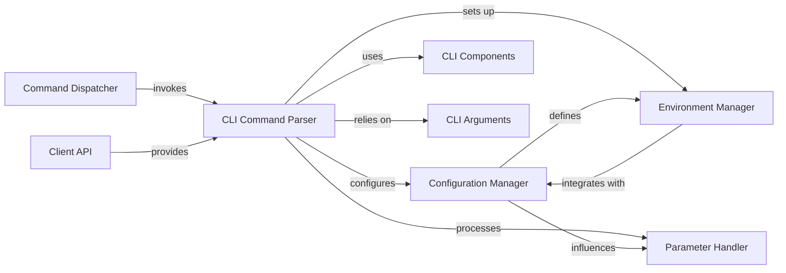

## Component Details

The User Interaction & Configuration component provides the primary interface for users to interact with Metaflow. It encompasses the command-line interface (CLI) for executing and managing flows, handling flow parameters, and managing user-defined and system-wide configurations. Additionally, it sets up and validates the execution environment, including Python and R dependencies, ensuring a consistent and correct runtime for Metaflow operations. The main flow involves parsing CLI commands, initializing the Metaflow runtime context with appropriate configurations and environment settings, and then dispatching the requested operations, such as running or checking a flow.

### CLI Command Parser
Parses command-line arguments and dispatches them to the appropriate Metaflow commands. It acts as the entry point for user interaction.

**Related Classes/Methods**:

- <a href="https://github.com/netflix/metaflow/blob/master/metaflow/cli.py#L119-L120" target="_blank" rel="noopener noreferrer">`metaflow.cli.cli` (119:120)</a>
- <a href="https://github.com/netflix/metaflow/blob/master/metaflow/cli.py#L298-L542" target="_blank" rel="noopener noreferrer">`metaflow.cli.start` (298:542)</a>
- <a href="https://github.com/netflix/metaflow/blob/master/metaflow/cli.py#L604-L641" target="_blank" rel="noopener noreferrer">`metaflow.cli.main` (604:641)</a>

### Configuration Manager
Manages all system-wide and user-defined configuration settings for Metaflow, including datastore roots, package suffixes, and various service types (metadata, environment, event logger, monitor).

**Related Classes/Methods**:

- `metaflow.metaflow_config` (full file reference)
- `metaflow.user_configs` (full file reference)
- `metaflow.metaflow_config_funcs` (full file reference)
- <a href="https://github.com/netflix/metaflow/blob/master/metaflow/cli.py#L298-L542" target="_blank" rel="noopener noreferrer">`metaflow.cli.start` (298:542)</a>

### Parameter Handler
Handles the definition, parsing, and validation of configurable inputs (parameters) for Metaflow flows, allowing dynamic customization of flow behavior.

**Related Classes/Methods**:

- `metaflow.parameters` (full file reference)
- <a href="https://github.com/netflix/metaflow/blob/master/metaflow/cli.py#L298-L542" target="_blank" rel="noopener noreferrer">`metaflow.cli.start` (298:542)</a>

### Environment Manager
Defines, validates, and manages the execution environment for Metaflow runs, including Python and R package dependencies and system-level settings.

**Related Classes/Methods**:

- `metaflow.metaflow_environment` (full file reference)
- `metaflow.plugins.pypi` (full file reference)
- `metaflow.R` (full file reference)
- <a href="https://github.com/netflix/metaflow/blob/master/metaflow/cli.py#L298-L542" target="_blank" rel="noopener noreferrer">`metaflow.cli.start` (298:542)</a>

### CLI Components
Provides modular components for various CLI commands, such as 'init', 'dump', 'step', 'run', and 'resume', which are lazily loaded.

**Related Classes/Methods**:

- `metaflow.cli_components` (full file reference)
- <a href="https://github.com/netflix/metaflow/blob/master/metaflow/cli.py#L119-L120" target="_blank" rel="noopener noreferrer">`metaflow.cli.cli` (119:120)</a>

### CLI Arguments
Manages and sets top-level command-line arguments for Metaflow, ensuring consistent access to CLI parameters across the application.

**Related Classes/Methods**:

- `metaflow.cli_args` (full file reference)
- <a href="https://github.com/netflix/metaflow/blob/master/metaflow/cli.py#L298-L542" target="_blank" rel="noopener noreferrer">`metaflow.cli.start` (298:542)</a>

### Command Dispatcher
Responsible for invoking the correct Metaflow command based on user input, handling exceptions, and managing the overall CLI execution flow.

**Related Classes/Methods**:

- `metaflow.cmd` (full file reference)
- <a href="https://github.com/netflix/metaflow/blob/master/metaflow/cli.py#L604-L641" target="_blank" rel="noopener noreferrer">`metaflow.cli.main` (604:641)</a>

### Client API
Provides an interface for interacting with Metaflow runs and data, potentially used by CLI commands to retrieve information or manage flows.

**Related Classes/Methods**:

- `metaflow.client` (full file reference)

### [FAQ](https://github.com/CodeBoarding/GeneratedOnBoardings/tree/main?tab=readme-ov-file#faq)