```mermaid
graph LR
    Core_Workflow_Engine["Core Workflow Engine"]
    Data_Metadata_Services["Data & Metadata Services"]
    User_Interaction_Configuration["User Interaction & Configuration"]
    Extensibility_Orchestration_Layer["Extensibility & Orchestration Layer"]
    Observability_System_Utilities["Observability & System Utilities"]
    Core_Workflow_Engine -- "manages data via" --> Data_Metadata_Services
    Core_Workflow_Engine -- "is controlled by" --> User_Interaction_Configuration
    Data_Metadata_Services -- "stores for" --> Core_Workflow_Engine
    Data_Metadata_Services -- "provides data to" --> User_Interaction_Configuration
    User_Interaction_Configuration -- "configures" --> Core_Workflow_Engine
    User_Interaction_Configuration -- "retrieves from" --> Data_Metadata_Services
    Extensibility_Orchestration_Layer -- "extends functionality of" --> Core_Workflow_Engine
    Extensibility_Orchestration_Layer -- "enables external execution for" --> Core_Workflow_Engine
    Observability_System_Utilities -- "monitors" --> Core_Workflow_Engine
    Observability_System_Utilities -- "provides utilities to" --> User_Interaction_Configuration
    click Core_Workflow_Engine href "https://github.com/CodeBoarding/GeneratedOnBoardings/blob/main/metaflow/Core Workflow Engine.md" "Details"
    click Data_Metadata_Services href "https://github.com/CodeBoarding/GeneratedOnBoardings/blob/main/metaflow/Data & Metadata Services.md" "Details"
    click User_Interaction_Configuration href "https://github.com/CodeBoarding/GeneratedOnBoardings/blob/main/metaflow/User Interaction & Configuration.md" "Details"
    click Extensibility_Orchestration_Layer href "https://github.com/CodeBoarding/GeneratedOnBoardings/blob/main/metaflow/Extensibility & Orchestration Layer.md" "Details"
    click Observability_System_Utilities href "https://github.com/CodeBoarding/GeneratedOnBoardings/blob/main/metaflow/Observability & System Utilities.md" "Details"
```

## Component Details

Metaflow is a human-centric framework for data science, designed to simplify the development and deployment of machine learning and data processing workflows. Its main flow involves defining a workflow using Python classes, executing it locally or on various cloud orchestrators, managing data and metadata, and providing tools for observability and interaction. The purpose is to enable data scientists to build and manage complex data pipelines efficiently.

### Core Workflow Engine
The central component responsible for defining, parsing, executing, and deploying Metaflow workflows. It manages the flow graph, individual task execution, and integrates with various runtime environments.

**Related Classes/Methods**:

- `metaflow.flowspec` (full file reference)
- `metaflow.graph` (full file reference)
- `metaflow.runtime` (full file reference)
- `metaflow.task` (full file reference)
- `metaflow.runner` (full file reference)
- `metaflow.multicore_utils` (full file reference)
- `metaflow.procpoll` (full file reference)
- `metaflow.clone_util` (full file reference)
- `metaflow.unbounded_foreach` (full file reference)

### Data & Metadata Services
Manages the persistence, retrieval, and versioning of all data artifacts and metadata generated during Metaflow runs, supporting various local and cloud storage backends.

**Related Classes/Methods**:

- `metaflow.datastore` (full file reference)
- `metaflow.metadata_provider` (full file reference)
- `metaflow.plugins.datastores.local_storage` (full file reference)
- `metaflow.plugins.datastores.s3_storage` (full file reference)
- `metaflow.plugins.datastores.azure_storage` (full file reference)
- `metaflow.plugins.datastores.gs_storage` (full file reference)

### User Interaction & Configuration
Provides the primary interface for users to interact with Metaflow, including the command-line interface, management of flow parameters, user-defined configurations, and environment setup for Python and R.

**Related Classes/Methods**:

- <a href="https://github.com/netflix/metaflow/blob/master/metaflow/cli.py#L119-L120" target="_blank" rel="noopener noreferrer">`metaflow.cli` (119:120)</a>
- `metaflow.cli_components` (full file reference)
- `metaflow.cmd` (full file reference)
- `metaflow.cli_args` (full file reference)
- `metaflow.parameters` (full file reference)
- `metaflow.user_configs` (full file reference)
- `metaflow.metaflow_config` (full file reference)
- `metaflow.metaflow_config_funcs` (full file reference)
- `metaflow.metaflow_environment` (full file reference)
- `metaflow.plugins.pypi` (full file reference)
- `metaflow.R` (full file reference)
- `metaflow.client` (full file reference)

### Extensibility & Orchestration Layer
A modular system that extends Metaflow's capabilities through decorators and a comprehensive plugin architecture, enabling integration with external orchestration platforms (e.g., AWS Batch, Kubernetes) and managing secrets.

**Related Classes/Methods**:

- `metaflow.decorators` (full file reference)
- `metaflow.user_configs.config_decorators` (full file reference)
- `metaflow.extension_support` (full file reference)
- `metaflow.plugins` (full file reference)
- `metaflow.plugins.aws` (full file reference)
- `metaflow.plugins.kubernetes` (full file reference)
- `metaflow.plugins.airflow` (full file reference)
- `metaflow.plugins.argo` (full file reference)
- `metaflow.plugins.timeout_decorator` (full file reference)
- `metaflow.plugins.retry_decorator` (full file reference)
- `metaflow.plugins.catch_decorator` (full file reference)
- `metaflow.plugins.project_decorator` (full file reference)
- `metaflow.plugins.parallel_decorator` (full file reference)
- `metaflow.plugins.events_decorator` (full file reference)
- `metaflow.plugins.secrets` (full file reference)
- `metaflow.plugins.cards` (full file reference)

### Observability & System Utilities
Provides essential system-level functionalities including tracing, monitoring, logging, and managing background sidecar processes, along with a collection of general-purpose utility functions and vendored libraries.

**Related Classes/Methods**:

- `metaflow.tracing` (full file reference)
- `metaflow.event_logger` (full file reference)
- `metaflow.monitor` (full file reference)
- `metaflow.mflog` (full file reference)
- `metaflow.system` (full file reference)
- `metaflow.sidecar` (full file reference)
- `metaflow.plugins.env_escape` (full file reference)
- `metaflow.util` (full file reference)
- `metaflow.cmd_with_io` (full file reference)
- `metaflow.metaflow_version` (full file reference)
- `metaflow.metaflow_current` (full file reference)
- `metaflow.tagging_util` (full file reference)
- `metaflow.debug` (full file reference)
- `metaflow.info_file` (full file reference)
- `metaflow._vendor` (full file reference)

### [FAQ](https://github.com/CodeBoarding/GeneratedOnBoardings/tree/main?tab=readme-ov-file#faq)