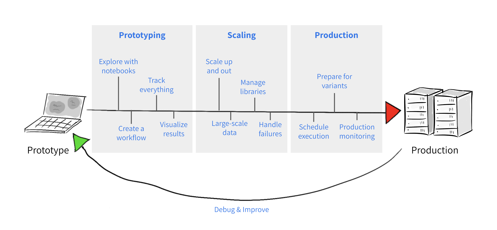
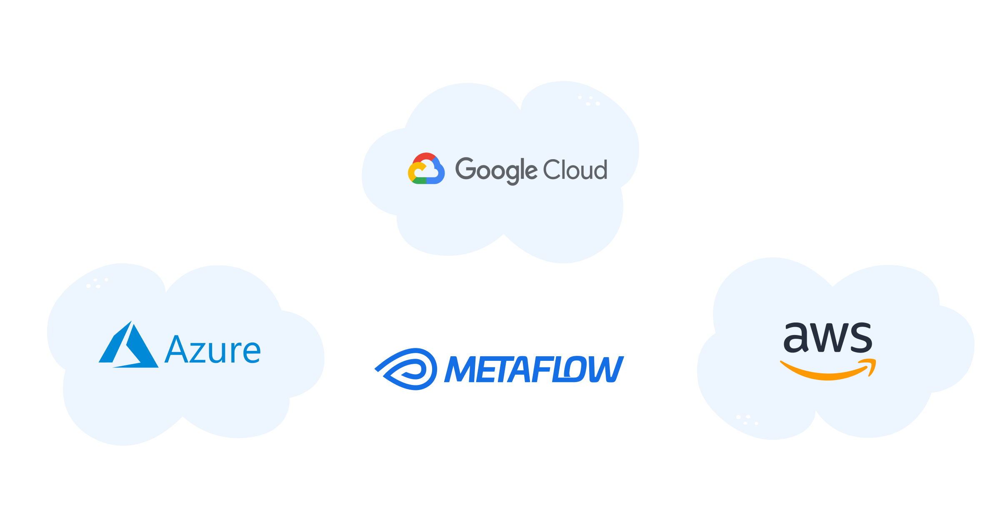

# Metaflow

Metaflow is a human-friendly library that helps scientists and engineers build and manage real-life data science projects. Metaflow was [originally developed at Netflix](https://netflixtechblog.com/open-sourcing-metaflow-a-human-centric-framework-for-data-science-fa72e04a5d9) to boost productivity of data scientists who work on a wide variety of projects from classical statistics to state-of-the-art deep learning.

For more information, see [Metaflow's website](https://metaflow.org) and [documentation](https://docs.metaflow.org).

## From prototype to production (and back)

Metaflow provides a simple, friendly API that covers foundational needs of ML, AI, and data science projects:


1. [Rapid local prototyping](https://docs.metaflow.org/metaflow/basics), [support for notebooks](https://docs.metaflow.org/metaflow/visualizing-results), and [built-in experiment tracking and versioning](https://docs.metaflow.org/metaflow/client).
2. [Horizontal and vertical scalability to the cloud](https://docs.metaflow.org/scaling/remote-tasks/introduction), utilizing both CPUs and GPUs, and [fast data access](https://docs.metaflow.org/scaling/data).
3. [Managing dependencies](https://docs.metaflow.org/scaling/dependencies) and [one-click deployments to highly available production orchestrators](https://docs.metaflow.org/production/introduction).


## Getting started

Getting up and running is easy. If you don't know where to start, [Metaflow sandbox](https://outerbounds.com/sandbox) will have you running and exploring Metaflow in seconds.

### Installing Metaflow in your Python environment

To install Metaflow in your local environment, you can install from [PyPi](https://pypi.org/project/metaflow/):

```sh
pip install metaflow
```
Alternatively, you can also install from [conda-forge](https://anaconda.org/conda-forge/metaflow):

```sh
conda install -c conda-forge metaflow
```
If you are eager to try out Metaflow in practice, you can start with the [tutorial](https://docs.metaflow.org/getting-started/tutorials). After the tutorial, you can learn more about how Metaflow works [here](https://docs.metaflow.org/metaflow/basics).

### Deploying infrastructure for Metaflow in your cloud



While you can get started with Metaflow easily on your laptop, the main benefits of Metaflow lie in its ability to [scale out to external compute clusters](https://docs.metaflow.org/scaling/remote-tasks/introduction) 
and to [deploy to production-grade workflow orchestrators](https://docs.metaflow.org/production/introduction). To benefit from these features, follow this [guide](https://outerbounds.com/engineering/welcome/) to 
configure Metaflow and the infrastructure behind it appropriately.

## [Resources](https://docs.metaflow.org/introduction/metaflow-resources)

### [Slack Community](http://slack.outerbounds.co/)
An active [community](http://slack.outerbounds.co/) of thousands of data scientists and ML engineers discussing the ins-and-outs of applied machine learning.

### [Tutorials](https://outerbounds.com/docs/tutorials-index/)
- [Introduction to Metaflow](https://outerbounds.com/docs/intro-tutorial-overview/)
- [Natural Language Processing with Metaflow](https://outerbounds.com/docs/nlp-tutorial-overview/)
- [Computer Vision with Metaflow](https://outerbounds.com/docs/cv-tutorial-overview/)
- [Recommender Systems with Metaflow](https://outerbounds.com/docs/recsys-tutorial-overview/)
- And more advanced content [here](https://outerbounds.com/docs/tutorials-index/)

### [Generative AI and LLM use cases](https://outerbounds.com/blog/?category=Foundation%20Models)
- [Infrastructure Stack for Large Language Models](https://outerbounds.com/blog/llm-infrastructure-stack/)
- [Parallelizing Stable Diffusion for Production Use Cases](https://outerbounds.com/blog/parallelizing-stable-diffusion-production-use-cases/)
- [Whisper with Metaflow on Kubernetes](https://outerbounds.com/blog/whisper-kubernetes/)
- [Training a Large Language Model With Metaflow, Featuring Dolly](https://outerbounds.com/blog/train-dolly-metaflow/)

## Get in touch
There are several ways to get in touch with us:
- [Slack Community](http://slack.outerbounds.co/)
- [Github Issues](https://github.com/Netflix/metaflow/issues)

## Contributing
We welcome contributions to Metaflow. Please see our [contribution guide](https://docs.metaflow.org/introduction/contributing-to-metaflow) for more details.
