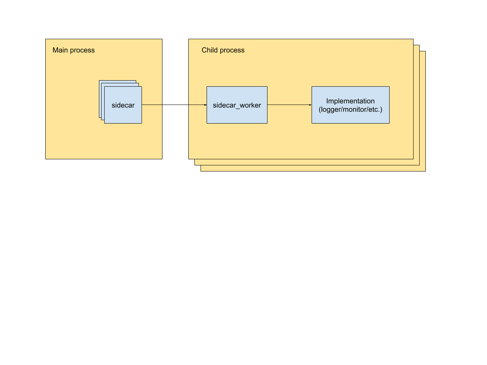

# Sidecars overview

## Purpose

There are several use cases around logging, monitoring, and 
possibly other “tier 2” features that would benefit from a nonblocking implementation. 
So anything running within a sidecar should be able to be executed asynchronously from the main process, 
with no strong consistency requirement between it and the main process. This will help ensure that errors 
in non-critical flows do not cause the whole workflow to fail and reduces the latency overhead added 
by the platform itself.

## Design/Architecture
Sidecars are run under a separate subprocess (sidecar worker) that engages in one-way communication with 
the main process (sidecar class) via 
[pipes](https://www.tutorialspoint.com/inter_process_communication/inter_process_communication_pipes.htm). 
The sidecar worker consumes messages from the main process via stdin and logs debug and error messages to stderr. 
Note that since metaflow blocks the completion of a task until the termination of stdout (to collect the logs), 
the stdout for sidecars is directed to dev/nul instead of inheriting the stdout of the parent process to ensure
the process is non-blocking.
 

#### Interface
Every implementation of sidecar needs to implement the following two methods:

#### `def process_message(msg: Message)`

- The function that handles how each message is processed

#### `def shutdown()`

- Defines the "best effort" shutdown mechanism for the subprocess. 

## Specific Implementations

### Heartbeat

We send heart beats to metadata service in a sidecar, `heartbeat.py` to
detect whether the task is alive. Since heart beats are purely informational,
we didn't want to increase the latency of the main process due to these 
service calls, nor we wanted to fail the whole parent process in case of a 
request failing. A sidecar that handles communication with the metadata 
service was a perfect solution.

 