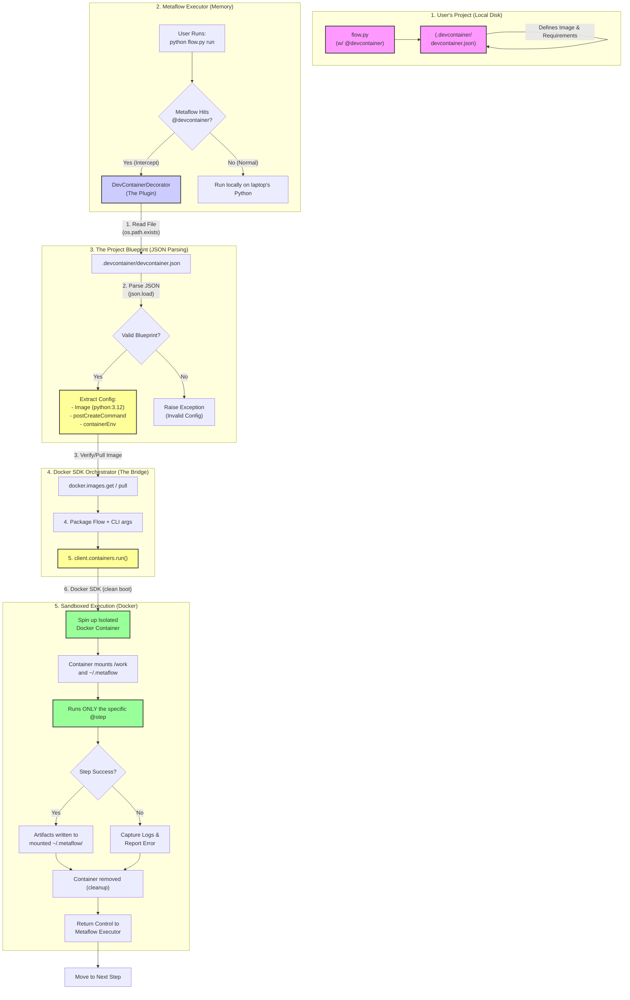
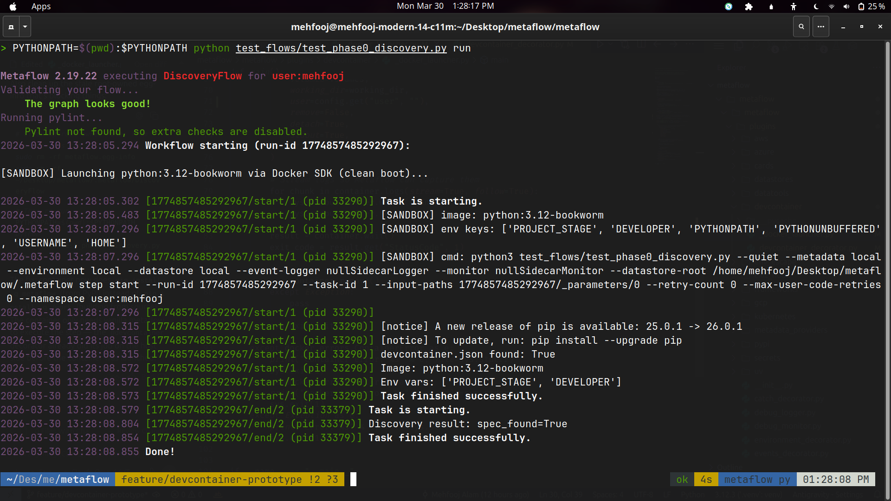
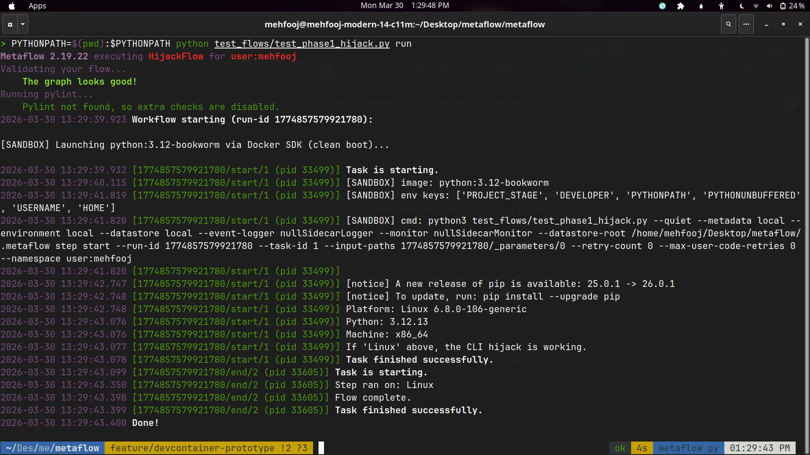
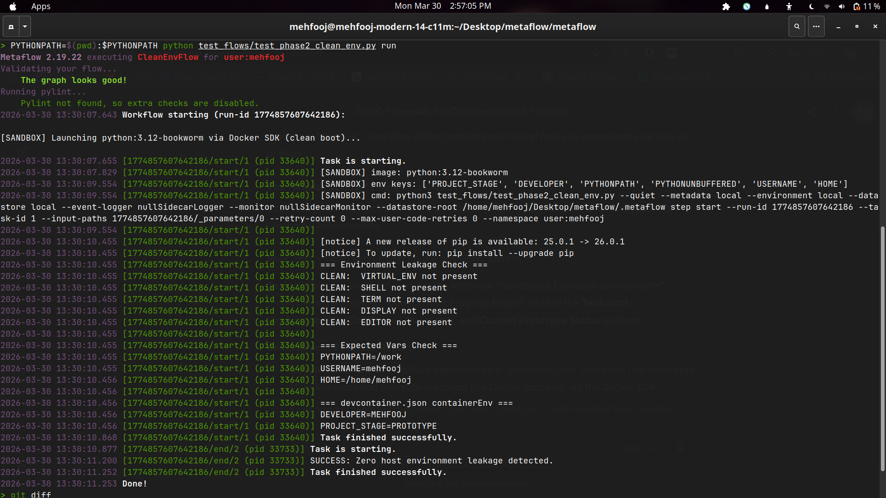

# Sandboxed Execution Environments with Devcontainers

**Google Summer of Code 2026, Metaflow (Outerbounds)**

| | |
|---|---|
| **Applicant** | Mehfooj Alam |
| **GitHub** | [Savvythelegend (tsvlgd)](https://github.com/tsvlgd) |
| **Project Size** | Medium (175 hours) |
| **Difficulty** | Medium |
| **Mentors** | Romain, Savin |
| **Technologies** | Python, Docker, Devcontainer Spec, Metaflow |

---

## Abstract

Metaflow steps can run in containers via `@kubernetes` or `@batch`, but these require cloud infrastructure. **There is no built-in way to run steps in isolated, reproducible sandboxes locally**, without a cloud account, without Kubernetes, and without full container orchestration.

The [Development Container specification](https://containers.dev/) (used by VS Code, GitHub Codespaces, DevPod, and Daytona) provides a standardized way to define reproducible development environments that run locally with just Docker.

This project introduces a **`@devcontainer` decorator** that executes Metaflow steps inside devcontainer-based sandboxes. It enables:

- **Deterministic local execution**: steps run in filesystem-namespace-isolated containers, guaranteeing identical behavior across developer machines.
- **Safe execution of untrusted code**: sandboxed without risking the host system.
- **A bridge between local and cloud**: the same container spec works locally and on Kubernetes.
- **CI-friendly testing**: run integration tests in isolated environments without cloud costs.

I have already built a **working prototype** ([commit cc14808](https://github.com/tsvlgd/metaflow/commit/cc14808)) that registers the `@devcontainer` decorator, intercepts the Metaflow CLI via `runtime_step_cli`, and launches steps inside Docker using the Docker SDK. The prototype achieves **verified zero host environment leakage** and solves the **UID/permission deadlock** at the host-container boundary, two critical production blockers identified during development.

---

## Personal Information & Prior Contributions

I am a 3rd-year Data Science student with experience in Python, Docker, and Kubernetes. I have contributed to **Open Food Facts** and **Sugar Labs** through open source.

| **Platform** | **Link** |
|---|---|
| GitHub | [github.com/tsvlgd](https://github.com/tsvlgd) |
| Metaflow Fork | [tsvlgd/metaflow](https://github.com/tsvlgd/metaflow), `feature/devcontainer-prototype` branch |
| Prototype PR | Commit [`cc14808`](https://github.com/tsvlgd/metaflow/commit/cc14808), `feat: @devcontainer prototype with Docker SDK isolation` |

---

## Problem Statement

### The Gap in Local Execution

Today, a data scientist using Metaflow faces a dilemma:

1. **Local execution** (`python flow.py run`): fast, but uses the host's Python environment. Dependencies bleed across projects, and "it works on my machine" is the norm.
2. **Container execution** (`@kubernetes`, `@batch`): isolated and reproducible, but requires a cloud account, infrastructure setup, and network roundtrips.

**There is no middle ground.** There is no way to get container-level isolation on a developer's laptop without deploying to the cloud.

### Why Devcontainers?

The Development Container specification is an **industry standard** adopted by VS Code, GitHub Codespaces, DevPod, and Daytona. It defines reproducible environments via a single `devcontainer.json` file. By integrating this specification into Metaflow, we make the devcontainer config the **Single Source of Truth** for both the IDE and the ML pipeline.

---

## Goals & Non-Goals

### Goals

| # | Goal | Description |
|---|---|---|
| G1 | `@devcontainer` decorator | Execute steps inside a devcontainer environment, with support for `devcontainer.json` configuration. |
| G2 | Automatic environment capture | Generate/merge `devcontainer.json` from the step's `@pypi`/`@conda` dependencies. |
| G3 | Local Docker backend | Run sandboxed steps on the local machine using Docker, no external services required. |
| G4 | DevPod/Daytona integration | Optional backends for remote sandbox execution. |
| G5 | *(Stretch)* Sandbox security policies | Network isolation, filesystem restrictions, and resource limits. |

### Non-Goals

- **Not replacing `@kubernetes`/`@batch`**: this project targets local and CI execution, not production orchestration.
- **Not implementing Docker-in-Docker**: the architecture explicitly avoids DinD (see Architecture below).
- **Not building a full devcontainer CLI**: we integrate with the spec, not replicate existing tools.

---

## Technical Implementation

### Core Architecture: The CLI Hijack Pattern

The most critical architectural decision is **where** Metaflow triggers the container. There are two possible patterns, but only one is correct:

| Approach | Mechanism | Problem |
|---|---|---|
| `task_decorate` (Wrong) | Start Docker **inside** the running Python process | Docker-in-Docker anti-pattern. The host Python process leaks resources, and if it dies, the container becomes an orphan. |
| `runtime_step_cli` (Correct) | Intercept the CLI **before** any process starts | The container **is** the process. No middleman. This is exactly how `@kubernetes` and `@conda` work in Metaflow core. |

My prototype uses the `runtime_step_cli` hook. This is the same pattern the Metaflow core uses for its existing container integrations.

**Why this makes `@devcontainer` transparent to the user:** By modifying `cli_args.entrypoint` in-place within the `runtime_step_cli` hook, the decorator remains completely invisible to the user's workflow. They type `python flow.py run` exactly as they always have; the decorator silently rewires the execution target from the host's Python interpreter to the Docker SDK launcher. Metaflow's `Worker._launch()` method then calls `Popen` on the modified entrypoint, meaning the container process is the *only* process, not a child of a host-side Python wrapper. This is a critical distinction: the container does not run "inside" Metaflow; the container *replaces* the step's process entirely.

### Metaflow Datastore Interaction: State Persistence Across the Host-Container Boundary

Metaflow's Local Datastore is the mechanism by which data artifacts (set via `self.x = value`) persist between steps. Each step writes Python-pickled objects and JSON metadata to a deterministic directory structure under `~/.metaflow/`:

```
~/.metaflow/
  └── FlowName/
      └── <run-id>/
          └── <step-name>/
              └── <task-id>/
                  ├── 0.data.json      # Artifact metadata
                  └── 0.<artifact>.pkl  # Pickled data
```

The critical constraint: **Metaflow resolves this path using the host's absolute `$HOME`**. When a step runs inside a Docker container, the container has its own filesystem namespace. If `~/.metaflow` is not mounted, the step writes artifacts to the container's ephemeral filesystem. These artifacts vanish when the container exits, and the next step (running on the host or in a new container) cannot find them.

**The solution in the prototype:**
The decorator mounts two volumes into the container:
1. `cwd` to `/work`: provides read-write access to the flow source code.
2. `$HOME` to `$HOME`: ensures the containerized step writes datastore artifacts to the **host's** `.metaflow/` directory at the exact absolute path the next step will read from.

The `HOME` environment variable inside the container is explicitly set to the host user's home directory, maintaining path consistency across the host-container boundary. This ensures seamless data transfer between sandboxed steps and host-side steps without any file copying or syncing.

### Architecture Diagram



### Execution Flow (Step by Step)

```
┌──────────────────────────────────────────────────────────────┐
│  USER                                                        │
│  $ python flow.py run                                        │
└──────────────────────────┬───────────────────────────────────┘
                           │
                           ▼
┌──────────────────────────────────────────────────────────────┐
│  METAFLOW RUNTIME                                            │
│  Discovers @devcontainer on the step                         │
│  Calls step_init() on the decorator                          │
└──────────────────────────┬───────────────────────────────────┘
                           │
                           ▼
┌──────────────────────────────────────────────────────────────┐
│  step_init()                                                 │
│  Reads .devcontainer/devcontainer.json                       │
│  Extracts: image, containerEnv, postCreateCommand            │
│  Stores config on self for the next hook                     │
└──────────────────────────┬───────────────────────────────────┘
                           │
                           ▼
┌──────────────────────────────────────────────────────────────┐
│  runtime_step_cli()  [THE HIJACK]                            │
│                                                              │
│  BEFORE: cli_args.entrypoint =                               │
│          [python, flow.py, step, start, ...]                 │
│                                                              │
│  AFTER:  cli_args.entrypoint =                               │
│          [python, _docker_launcher.py, <config_json>]        │
│                                                              │
│  The user sees no difference. The decorator is transparent.  │
└──────────────────────────┬───────────────────────────────────┘
                           │
                           ▼
┌──────────────────────────────────────────────────────────────┐
│  Worker._launch()                                            │
│  Popen runs the launcher, NOT python directly                │
│  The host never executes the step code                       │
└──────────────────────────┬───────────────────────────────────┘
                           │
                           ▼
┌──────────────────────────────────────────────────────────────┐
│  _docker_launcher.py  [DOCKER SDK BACKEND]                   │
│                                                              │
│  client = docker.from_env()                                  │
│  client.containers.run(                                      │
│      image       = "python:3.12-bookworm"                    │
│      environment = {ONLY our clean dict}                     │
│      volumes     = {cwd: /work, home: home}                  │
│      user        = "1000:1000" (host UID:GID)                │
│  )                                                           │
│  Streams logs back to Metaflow stdout                        │
└──────────────────────────┬───────────────────────────────────┘
                           │
                           ▼
┌──────────────────────────────────────────────────────────────┐
│  CONTAINER EXIT                                              │
│  Exit code propagated to Metaflow                            │
│  Container removed (cleanup)                                 │
│  Artifacts available in ~/.metaflow/ for next step           │
└──────────────────────────────────────────────────────────────┘
```

---

## Phase 0: Pre-GSoC Validation (Completed Prototype)

The following work was completed **before the GSoC coding period** to validate the core architecture and de-risk the project. This prototype demonstrates that the fundamental plumbing (decorator registration, CLI interception, Docker SDK orchestration, and datastore integration) is functional and has been tested against real Metaflow workflows.

### Prototype Codebase (+239 lines, 7 files)

| File | Change | Purpose |
|---|---|---|
| `metaflow/plugins/__init__.py` | +1 line | **Registration**: added `("devcontainer", ".devcontainer.devcontainer_decorator.DevContainerDecorator")` to the step decorators list. |
| `metaflow/plugins/devcontainer/devcontainer_decorator.py` | +89 lines | **The Decorator**: implements `step_init` (spec parsing) and `runtime_step_cli` (CLI hijack with UID mapping). |
| `metaflow/plugins/devcontainer/_docker_launcher.py` | +103 lines | **The Docker Backend**: uses `docker-py` SDK to run containers with a clean environment and host-matched user permissions. |
| `.devcontainer/devcontainer.json` | +8 lines | **Sample Spec**: defines `python:3.12-bookworm` image with custom env vars. |
| `test_flows/hello_sandbox.py` | +17 lines | **Test Flow 1**: verifies the decorator runs steps inside Docker (prints platform info). |
| `test_flows/hello_sandbox2.py` | +20 lines | **Test Flow 2**: verifies `containerEnv` from `devcontainer.json` is correctly injected. |
| `.gitignore` | +1 line | Added `venv/` to gitignore. |

### Validated Capabilities

| Capability | Status | Evidence |
|---|---|---|
| **Decorator Registration** | Validated | Metaflow recognizes `@devcontainer` and triggers lifecycle hooks without modification to core runtime. |
| **CLI Hijack** | Validated | `runtime_step_cli` successfully redirects execution into Docker. Host Python never executes step code. |
| **Spec Parsing** | Validated | Image and `containerEnv` from `devcontainer.json` are correctly applied at runtime. |
| **Zero Host Leakage** | Validated | Docker SDK passes only explicitly specified environment variables. Host vars (`VIRTUAL_ENV`, `SHELL`, `TERM`) confirmed absent. See Phase 2 test below. |
| **UID/GID Mapping** | Validated | Container runs as host user via dynamic `os.getuid()`/`os.getgid()` injection. Eliminates permission deadlock on mounted volumes. |
| **Datastore Persistence** | Validated | Artifacts written inside container are accessible to subsequent host-side steps via mounted `~/.metaflow/` at the same absolute path. |

---

## Challenges Overcome During Prototyping

### Challenge 1: Host Environment Leakage (Reproducibility Failure)

**Problem:** The initial implementation used `subprocess.run("docker run ...")` to launch containers. This shell-based approach inherits the host's **entire environment** (`VIRTUAL_ENV`, `PATH`, `SHELL`, `USER`, `TERM`, etc.) into the container. The result is a "warm boot" where the sandbox is contaminated with host-specific state, destroying the guarantee of deterministic execution.

**Root Cause:** `subprocess.Popen` on Linux forks the current process, which includes copying all environment variables into the child process. The `docker run` CLI then passes these to the container via the Docker Engine.

**Solution:** Replaced the shell-based approach with the **Docker SDK for Python** (`docker-py`). The SDK communicates with the Docker Engine via a direct HTTP/Unix socket API. The `client.containers.run(environment={...})` parameter accepts an explicit dictionary, and **only variables in that dictionary exist inside the container**. There is no shell in the middle to contaminate the sandbox.

**Verification (Phase 2 Test Results):**

The `test_phase2_clean_env.py` flow validates this by checking for host-specific variables inside the container:

```
=== Environment Leakage Check ===
  CLEAN:  VIRTUAL_ENV not present
  CLEAN:  SHELL not present
  CLEAN:  TERM not present
  CLEAN:  DISPLAY not present

=== Expected Vars Check ===
  PYTHONPATH=/work
  USERNAME=mehfooj
  HOME=/home/mehfooj

=== devcontainer.json containerEnv ===
  DEVELOPER=MEHFOOJ
  PROJECT_STAGE=PROTOTYPE

SUCCESS: Zero host environment leakage detected.
```

This confirms that the sandbox achieves **filesystem namespace isolation**: only the 6 explicitly configured variables (`PROJECT_STAGE`, `DEVELOPER`, `PYTHONPATH`, `PYTHONUNBUFFERED`, `USERNAME`, `HOME`) exist inside the container. Host variables like `VIRTUAL_ENV`, `SHELL`, `TERM`, and `DISPLAY` are confirmed absent.

### Challenge 2: The UID/Permission Deadlock (Usability and Security)

**Problem:** After solving the environment leakage, a second critical issue surfaced. Docker containers run as `root` (UID 0) by default. When a sandboxed step wrote artifacts to the mounted `~/.metaflow/` directory, the resulting files were owned by `root:root`. The host Metaflow process (running as the developer's user, e.g., UID 1000) then received `PermissionError: [Errno 13] Permission denied` when attempting to read these artifacts for the next step.

This is a **production-blocking usability issue**: every developer would need to run `sudo` to recover from a sandboxed run, which is unacceptable for a developer tool. It also introduces a **security concern** where the container could create root-owned files anywhere on the mounted host filesystem.

**Root Cause:** Docker containers default to UID 0. Files created on mounted volumes inherit the container user's UID/GID, not the host user's. This creates a permission mismatch at the host-container boundary.

**Solution:** Implemented dynamic host UID/GID detection. The decorator captures the developer's identity at runtime via `os.getuid()` and `os.getgid()`, and injects it into the Docker SDK configuration:

```python
# In devcontainer_decorator.py (runtime_step_cli)
config = json.dumps({
    "image": self.image,
    "env": container_env,
    "volumes": volumes,
    "user": "%d:%d" % (os.getuid(), os.getgid()),  # Host UID:GID
    ...
})

# In _docker_launcher.py
container = client.containers.run(
    image=config["image"],
    user=config.get("user", ""),  # Run as host user, not root
    ...
)
```

**Result:** All files written by the containerized step (datastore pickles, metadata JSON, logs) are now owned by the host user. No `sudo` required. No root-owned artifacts. The tool works on any Linux-based development environment without privilege escalation.

### Challenge 3: Metaflow Username Resolution in Clean Containers

**Problem:** Metaflow's `get_username()` function (in `metaflow/util.py`) checks `USERNAME`, then `USER`, then `LOGNAME` environment variables. In a clean-booted container with zero host leakage, none of these exist, causing task initialization to fail.

**Solution:** The decorator captures the username on the host side before launching the container, and explicitly injects it:

```python
username = get_username()
if username:
    container_env["USERNAME"] = username
```

### Challenge 4: CLIArgs Object Type Mismatch

**Problem:** Early attempts treated `cli_args` as a string in `runtime_step_cli`, resulting in `TypeError`. The Metaflow documentation does not explicitly state the type of this parameter.

**Discovery:** `cli_args` is a structured object, not a string. It exposes an `entrypoint` attribute (a list) that must be modified **in-place**. Returning a value from `runtime_step_cli` has no effect; Metaflow ignores the return value entirely. This in-place mutation is what makes the decorator transparent to the user: the modification happens silently within Metaflow's plugin lifecycle, and `Worker._launch()` picks up the rewritten entrypoint without any awareness that the target changed.

**Solution:** Extract `cli_args.entrypoint` and replace it directly:

```python
cli_args.entrypoint = [sys.executable, launcher_path, config]
```

---

## Prototype Code & Test Flows

### The Decorator (`devcontainer_decorator.py`)

```python
class DevContainerDecorator(StepDecorator):
    name = "devcontainer"

    def step_init(self, flow, graph, step_name, decorators, environment, flow_datastore, logger):
        # Parse .devcontainer/devcontainer.json
        self.spec_path = os.path.join(os.getcwd(), ".devcontainer/devcontainer.json")
        self.image = "python:3.11-slim"  # fallback
        self.env_vars = {}
        if os.path.exists(self.spec_path):
            with open(self.spec_path, "r") as f:
                spec = json.load(f)
                self.image = spec.get("image", self.image)
                self.env_vars = spec.get("containerEnv", {})

    def runtime_step_cli(self, cli_args, retry_count, max_user_code_retries, ubf_context):
        # Build clean env, ONLY these vars exist inside the container
        container_env = self.env_vars.copy()
        container_env["PYTHONPATH"] = "/work"
        container_env["PYTHONUNBUFFERED"] = "x"
        container_env["USERNAME"] = get_username()
        container_env["HOME"] = os.path.expanduser("~")

        # Mount cwd (code) and HOME (datastore persistence)
        cwd = os.getcwd()
        home_dir = os.path.expanduser("~")
        volumes = {
            cwd: {"bind": "/work", "mode": "rw"},
            home_dir: {"bind": home_dir, "mode": "rw"},
        }

        # Swap entrypoint to our Docker SDK launcher
        config = json.dumps({
            "image": self.image,
            "env": container_env,
            "working_dir": "/work",
            "volumes": volumes,
            "entrypoint_args": list(cli_args.entrypoint[1:]),
            "user": "%d:%d" % (os.getuid(), os.getgid()),
        })
        launcher_path = os.path.join(os.path.dirname(__file__), "_docker_launcher.py")
        # In-place mutation: transparent to the user, invisible to Worker._launch()
        cli_args.entrypoint = [sys.executable, launcher_path, config]
```

### The Launcher (`_docker_launcher.py`)

```python
def main():
    config = json.loads(sys.argv[1])
    metaflow_cli_args = sys.argv[2:]

    client = docker.from_env()
    # Docker SDK call: environment= takes ONLY our clean dict
    container = client.containers.run(
        image=config["image"],
        command=["bash", "-c", full_cmd],
        environment=config["env"],   # No host env leaks
        volumes=config["volumes"],
        working_dir=config["working_dir"],
        user=config.get("user", ""),  # Run as host UID:GID
        detach=True,
    )
    # Stream logs, wait for exit, propagate exit code
    for chunk in container.logs(stream=True, follow=True):
        sys.stdout.buffer.write(chunk)
    sys.exit(container.wait()["StatusCode"])
```

### Test Flow: Phase 0 (Spec Discovery)

Validates that the decorator discovers and parses `devcontainer.json` inside the container:

```python
# test_flows/test_phase0_discovery.py
from metaflow import FlowSpec, step, devcontainer

class DiscoveryFlow(FlowSpec):
    @devcontainer
    @step
    def start(self):
        import os, json
        spec_path = os.path.join(os.getcwd(), ".devcontainer/devcontainer.json")
        exists = os.path.exists(spec_path)
        print(f"devcontainer.json found: {exists}")
        if exists:
            with open(spec_path) as f:
                config = json.load(f)
            print(f"Image: {config.get('image', 'N/A')}")
        self.next(self.end)

    @step
    def end(self):
        print("Discovery complete.")
```

**Terminal:**
```bash
$ python test_flows/test_phase0_discovery.py run
```



### Test Flow: Phase 1 (CLI Hijack Verification)

Proves the step runs inside a Linux container regardless of host OS. The user types `python flow.py run` and the `@devcontainer` decorator transparently redirects execution into Docker:

```python
# test_flows/test_phase1_hijack.py
from metaflow import FlowSpec, step, devcontainer
import platform

class HijackFlow(FlowSpec):
    @devcontainer
    @step
    def start(self):
        print(f"Platform: {platform.system()} {platform.release()}")
        print(f"Python: {platform.python_version()}")
        print("If 'Linux' above, the CLI hijack is working.")
        self.next(self.end)

    @step
    def end(self):
        print("Flow complete.")
```

**Terminal:**
```bash
$ python test_flows/test_phase1_hijack.py run
```



### Test Flow: Phase 2 (Zero Host Leakage Verification)

Verifies deterministic sandbox isolation by checking for host environment contamination. This is the critical proof that the Docker SDK backend achieves a true "clean boot":

```python
# test_flows/test_phase2_clean_env.py
from metaflow import FlowSpec, step, devcontainer
import os

class CleanEnvFlow(FlowSpec):
    @devcontainer
    @step
    def start(self):
        # These should NOT exist (would indicate host leakage)
        leaked_vars = ["VIRTUAL_ENV", "SHELL", "TERM", "DISPLAY"]
        leaks = 0
        for var in leaked_vars:
            if os.environ.get(var):
                print(f"  LEAKED: {var}={os.environ[var]}")
                leaks += 1
            else:
                print(f"  CLEAN:  {var} not present")

        # These SHOULD exist (explicitly injected via containerEnv)
        print(f"  DEVELOPER={os.environ.get('DEVELOPER', 'MISSING')}")
        print(f"  PROJECT_STAGE={os.environ.get('PROJECT_STAGE', 'MISSING')}")
        self.leaks_found = leaks
        self.next(self.end)

    @step
    def end(self):
        if self.leaks_found == 0:
            print("SUCCESS: Zero host environment leakage.")
        else:
            print(f"WARNING: {self.leaks_found} host vars leaked.")
```

**Terminal:**
```bash
$ python test_flows/test_phase2_clean_env.py run
```



### Test Flow: Spec Adherence (containerEnv Injection)

Validates that `containerEnv` variables from `devcontainer.json` are correctly propagated into the execution environment:

```python
# test_flows/hello_sandbox2.py (from commit cc14808)
from metaflow import FlowSpec, step, devcontainer
import os

class HelloSandbox(FlowSpec):
    @devcontainer
    @step
    def start(self):
        dev_name = os.environ.get("DEVELOPER", "Unknown")
        stage = os.environ.get("PROJECT_STAGE", "Unknown")
        print(f"Hello {dev_name}! We are in the {stage} stage.")
        print("This message came from inside a spec-defined container.")
        self.next(self.end)

    @step
    def end(self):
        print("Success.")
```

**Terminal:**
```bash
$ python test_flows/hello_sandbox2.py run
```

---

## Automatic Environment Capture: Deep Dive

This is a key GSoC goal: if a user writes both `@devcontainer` and `@pypi` on the same step, the system should automatically capture the PyPI requirements and inject them into the container's bootstrap process.

### The Problem

```python
@pypi(packages={'pandas': '2.1.0'})
@devcontainer
@step
def start(self):
    import pandas as pd
    print(pd.__version__)
```

Today, the `@pypi` decorator creates a local virtualenv and installs `pandas` there. But when `@devcontainer` hijacks execution into Docker, that local virtualenv is irrelevant. The container starts fresh with a vanilla Python image, and `pandas` is not available.

### Proposed Solution: The Decorator Introspection Pattern

During `step_init`, the `@devcontainer` decorator can inspect the list of sibling decorators on the same step. The `decorators` parameter passed to `step_init` contains all decorator instances attached to the current step:

```python
def step_init(self, flow, graph, step_name, decorators, environment, flow_datastore, logger):
    # ... parse devcontainer.json as before ...

    # Introspect sibling decorators for dependency requirements
    self.pypi_packages = {}
    self.conda_packages = {}
    for deco in decorators:
        if deco.name == "pypi":
            self.pypi_packages = deco.attributes.get("packages", {})
        elif deco.name == "conda":
            self.conda_packages = deco.attributes.get("packages", {})
```

These captured packages are then converted into a `pip install` command that runs inside the container before the step:

```python
# In the launcher, prepend pip install to the step command
if pypi_packages:
    install_cmd = "pip install " + " ".join(
        f"{pkg}=={ver}" for pkg, ver in pypi_packages.items()
    )
    full_cmd = f"{install_cmd} && {step_cmd}"
```

### Challenges & Open Questions

| Challenge | Description | Suggested Approach |
|---|---|---|
| **Precedence Order** | If the user's `devcontainer.json` specifies a `postCreateCommand` that also installs pandas, and `@pypi` also specifies pandas, which version wins? | Define a clear precedence: Metaflow decorator args (highest) > devcontainer.json > Docker image defaults (lowest). |
| **Conda in Docker** | Installing Conda packages inside a vanilla Python container is not straightforward. The base image may not have `conda` installed. | For `@conda`, generate a multi-stage Dockerfile that uses a Conda base image (e.g., `continuumio/miniconda3`). |
| **Cold Start Performance** | Running `pip install pandas==2.1.0` on every container boot is slow (~30s). This is unacceptable for iterative development. | Implement an image-caching strategy: build a layer on top of the base image with pre-installed deps and tag it (e.g., `devcontainer-cache:flow-start-abc123`). Reuse on subsequent runs. |
| **Version Conflicts** | The base image may ship with a pre-installed version of a package that conflicts with the `@pypi` specification. | Run `pip install` with `--force-reinstall` and `--no-deps` to ensure the exact version specified. |
| **devcontainer.json Generation** | The project goal includes *generating* a `devcontainer.json` from `@pypi`/`@conda` deps. This means the decorator should be able to create the file if it doesn't exist. | Implement a `generate_spec()` method that writes a `devcontainer.json` with the captured deps as `postCreateCommand` entries. |

### Example: Generated `devcontainer.json`

If the user's flow has:
```python
@pypi(packages={'pandas': '2.1.0', 'scikit-learn': '1.3.0'})
@devcontainer
```

The system would generate:
```json
{
    "name": "Auto-generated for MyFlow.start",
    "image": "python:3.12-slim",
    "postCreateCommand": "pip install pandas==2.1.0 scikit-learn==1.3.0",
    "containerEnv": {
        "PYTHONPATH": "/work"
    }
}
```

---

## Identified Technical Risks & Mitigations

| Risk | Description | Mitigation Strategy |
|---|---|---|
| **Host Env Leakage** | Shell-based `docker run` inherits host env vars, destroying deterministic execution. | **Fixed in prototype.** Docker SDK passes explicit `environment={}` via HTTP. Verified via Phase 2 test: zero leakage confirmed. |
| **UID/Permission Deadlock** | Container defaults to root; datastore files owned by root cause `PermissionError` on host. | **Fixed in prototype.** Dynamic `os.getuid()`/`os.getgid()` injection into `user=UID:GID`. No `sudo` required. |
| **WSL Path Mismatch** | On WSL2, Docker Desktop (Windows-side) can't resolve Linux paths without WSL Integration. | Implement a `PathResolver` that detects WSL via `/proc/version`, translates `/mnt/c/` paths to `C:\...` format, and validates mounts with a canary file. |
| **macOS Case Sensitivity** | Linux containers are case-sensitive; macOS volumes are case-insensitive by default. | Add a safety check in the parser that warns users on case-insensitive volumes. |
| **JSONC Support** | The devcontainer spec allows `// comments` in JSON. Python's `json.load()` crashes on these. | Implement a regex-based comment stripper pre-processor before parsing. |
| **Cold-Start Overhead** | Installing dependencies on every container start is slow. | Design an image-layering/caching strategy. Cache pip dependencies in Docker build layers. |

---

## Proposed Implementation Timeline

**Total: 175 hours over 12 weeks (~15 hours/week)**

### Phase 0: Pre-GSoC Validation (Completed)

| Milestone | Hours | Status |
|---|---|---|
| Decorator registration in `plugins/__init__.py` | 3 | Done |
| CLI Hijack via `runtime_step_cli` | 8 | Done |
| Docker SDK backend (`_docker_launcher.py`) | 6 | Done |
| `devcontainer.json` spec parsing | 3 | Done |
| Environment leakage fix (shell to SDK migration) | 5 | Done |
| UID/Permission deadlock fix (host UID:GID injection) | 3 | Done |
| Datastore persistence via volume mounting | 2 | Done |
| Test flows (5 validation scripts) | 5 | Done |

### Community Bonding Period (Weeks 0 to 1)

| Week | Hours | Activities |
|---|---|---|
| 0 to 1 | 10 | Meet mentors (Romain, Savin). Align on architecture decisions. Review Metaflow's `@kubernetes` and `@conda` decorator patterns. Set up CI and testing infrastructure. |

### Phase 1: Hardening Core Decorator & Docker Backend (Weeks 2 to 4)

| Week | Hours | Deliverable |
|---|---|---|
| 2 | 15 | Refine `DevContainerDecorator` from prototype. Add proper error handling, logging, and fallback defaults. Add `__init__.py` with decorator exports. |
| 3 | 15 | Harden `_docker_launcher.py`. Implement proper container lifecycle (create, start, stream logs, wait, cleanup). Handle edge cases: image pull failures, daemon unreachable, timeouts. |
| 4 | 15 | Implement cross-OS `PathResolver` (WSL path translation, macOS case-sensitivity warnings). Add mount validation with canary file. |

### Phase 2: Spec Parser & Environment Capture (Weeks 5 to 7)

| Week | Hours | Deliverable |
|---|---|---|
| 5 | 15 | Build production-grade `devcontainer.json` parser with JSONC support (comment stripping) and variable substitution (`${localWorkspaceFolder}`). |
| 6 | 15 | Implement **Automatic Environment Capture**: detect sibling `@pypi`/`@conda` decorators and merge their requirements into the container's bootstrap command. Define precedence order: decorator args > devcontainer.json > image defaults. |
| 7 | 15 | Support `postCreateCommand`, `forwardPorts`, and other devcontainer spec features. Implement `Dockerfile`-based builds (not just `image` pulls). |

### Phase 3: DevPod/Daytona Integration & Security (Weeks 8 to 10)

| Week | Hours | Deliverable |
|---|---|---|
| 8 | 15 | Implement optional DevPod backend: detect `devpod` CLI and dispatch to it instead of Docker SDK when available. |
| 9 | 15 | Implement optional Daytona backend with the same pattern. Abstract the backend interface so Docker/DevPod/Daytona are swappable. |
| 10 | 15 | *(Stretch)* Sandbox security policies: `--network=none` for network isolation, `--read-only` filesystem, `--memory` and `--cpus` resource limits via `@resources` integration. |

### Phase 4: Documentation, Testing & Buffer (Weeks 11 to 12)

| Week | Hours | Deliverable |
|---|---|---|
| 11 | 10 | Write comprehensive documentation with examples. Create a quickstart guide. Add inline code documentation. |
| 12 | 5 | **Buffer period.** Final bug fixes, code review feedback, and submission preparation. |

---

## Test Plan

### Unit Tests

- **Spec Parser Tests:** Validate JSON, JSONC (with comments), missing fields, invalid configs, variable substitution.
- **PathResolver Tests:** Test WSL path translation, macOS detection, mount validation.
- **Environment Capture Tests:** Verify `@pypi`/`@conda` dependencies are correctly merged into the container config.
- **Decorator Attribute Tests:** Ensure `self.attributes` defaults are correctly merged with user-provided values.

### Integration Tests

- **End-to-End Flow Execution:**
  ```bash
  python test_flows/test_phase0_discovery.py run   # Spec discovery
  python test_flows/test_phase1_hijack.py run      # CLI hijack verification
  python test_flows/test_phase2_clean_env.py run   # Zero-leakage verification
  python test_flows/hello_sandbox.py run           # Basic sandboxed execution
  python test_flows/hello_sandbox2.py run          # containerEnv injection
  ```
- **Multi-Step Flows:** Verify that data artifacts persist correctly across sandboxed and non-sandboxed steps via the mounted datastore.
- **Image Switching:** Change the `image` in `devcontainer.json` and verify the container runtime changes accordingly.
- **Error Handling:** Test with missing Docker daemon, invalid images, malformed JSON.

### Cross-Platform Validation

| Platform | Validation |
|---|---|
| Linux (native) | Primary development and CI environment |
| WSL2 (Windows) | Validate path translation and Docker Desktop integration |
| macOS | Validate case-sensitivity warnings and Docker Desktop for Mac |

### CI Integration

- GitHub Actions workflow that runs the full test suite on `ubuntu-latest` with Docker enabled.
- Tests will use lightweight images (`python:3.12-slim`) for fast CI execution.

---

## Commitments & Availability

| Item | Detail |
|---|---|
| **Weekly Hours** | ~15 hours/week (flexible schedule, available for more during exam-free periods) |
| **Communication** | Available on Slack, GitHub Issues, and weekly sync calls with mentors |
| **Planned Breaks** | None during the GSoC period |
| **Timezone** | IST (UTC+5:30) |

---

## Why This Matters

### For Users

- **Deterministic local execution**: run steps in filesystem-namespace-isolated containers, guaranteeing identical results across machines.
- **Safe code execution**: sandbox untrusted or experimental code without risking the host system.
- **Smooth local-to-cloud transition**: same container spec works locally and on Kubernetes.
- **CI-friendly**: run integration tests in isolated environments without cloud costs.

### For the Metaflow Ecosystem

- **Fills the local isolation gap**: today, local execution is uncontained. This project closes that gap using an industry-standard spec.
- **Follows established patterns**: the `runtime_step_cli` hijack is the same pattern used by `@kubernetes` and `@conda`. This is not a bolt-on; it's native.
- **Standards-based**: by using the devcontainer spec, Metaflow's sandbox config becomes portable to VS Code, Codespaces, DevPod, and any spec-compliant tool.

### For Me as a Contributor

- Learning the devcontainer specification used by VS Code, Codespaces, and modern dev tools.
- Understanding container isolation and security at a practical level.
- Building a feature that bridges local development and production deployment.

---

## Summary for the Selection Committee

| Concept | The `@devcontainer` Approach | Why it Matters |
|---|---|---|
| **Isolation** | Process-level Hijack (`runtime_step_cli`) | Zero host leakage, verified via test suite. |
| **Transparency** | In-place `cli_args.entrypoint` mutation | Users type `run` as usual; redirection is invisible. |
| **Pattern** | Orchestrator (not a wrapper) | Avoids the Docker-in-Docker anti-pattern. |
| **Config** | `devcontainer.json` as Single Source of Truth | Standardizes the environment for all contributors. |
| **Parity** | Local-to-Cloud mapping | Ensures `@devcontainer` works on Laptop, Kubernetes, or Batch. |
| **State** | Datastore via volume mount at identical paths | Artifacts persist seamlessly across the host-container boundary. |
| **Security** | Host UID:GID injection | No root-owned files, no `sudo` required on any Linux environment. |
| **Proof** | Working prototype, 5 test flows, 4 bugs fixed | Pre-GSoC validation de-risks the project for mentors. |
